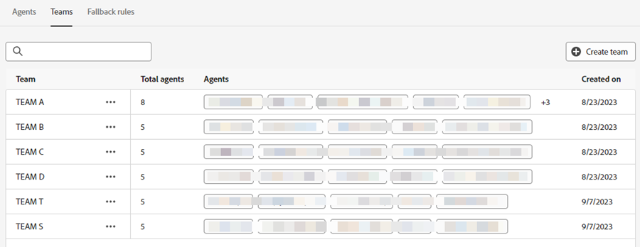
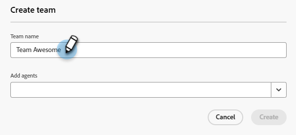

# Agent Management {#agent-management}

In het Beheer van de Agent, bekijk een lijst van agenten in uw instantie van Dynamic Chat, beheer teams, en plaats uw reserveregels.

## Medewerkers {#agents}

Dit tabblad bevat een lijst met alle agents in uw Dynamic Chat-exemplaar en informatie zoals de naam, het e-mailadres, de status van de livechat en meer.

{width="800" zoomable="yes"}

>[!NOTE]
>
>Ziet geen agent u _enkel_ toegevoegd? Het kan tot twee uur duren voordat ze hier worden weergegeven nadat ze in de Adobe Admin-console zijn toegevoegd.

## Teams {#teams}

Admins kunnen teams van agenten tot stand brengen om gemak te vergemakkelijken om aan specifieke groepen verkoopagenten te verpletteren.

>[!AVAILABILITY]
>
>Voor toegang tot teams is een Dynamic Chat Prime-abonnement vereist. Neem contact op met het Adobe-accountteam (uw accountmanager) voor meer informatie.

### Een team maken {#create-a-team}

1. Klik op **+ Team maken** .

   

1. Geef uw team een naam.

   

1. Klik **toevoegen Agenten** drop-down en selecteren de gewenste agenten.

   

1. Klik **creëren**.

   

## Regels voor alternatieven {#fallback-rules}

### Extra vergaderingen {#meeting-fallback}

Selecteer een standaardbericht (systeem) of schrijf een aangepast bericht voor bezoekers om te zien wanneer het boeken van de vergadering niet beschikbaar is.

### Live Chat-fallback {#live-chat-fallback}

Selecteer een standaardbericht (systeembericht) of schrijf een aangepast bericht dat bezoekers kunnen zien wanneer Live Chat niet beschikbaar is.

>[!NOTE]
>
>* Het selecteren van _omvat de Optie van het Boeken van de Vergadering_ checkbox zal de praatjebezoeker de optie geven om een vergadering te boeken wanneer geen agenten beschikbaar zijn om te leven praatje.
>
>* **voor om het even welke douaneregels/Teams als Levende kaart van het Praatje**: Terwijl het controleren op agenten, als zij niet beschikbaar zijn of niet konden verbinden, zal het terug naar Ronde Robin vallen om voor &quot;Beschikbare Agenten&quot;te proberen (allen die op dat ogenblik beschikbaar zijn ongeacht welke verpletterende logica/regel in de stroom werd geplaatst).

>[!TIP]
>
>Wanneer u een aangepast bericht maakt, kunt u het lettertype opmaken, koppelingen gebruiken en zelfs emojis invoegen! `:)`
