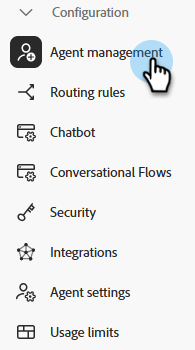

# Agent Management {#agent-management}

In het Beheer van de Agent, bekijk een lijst van agenten in uw instantie van de Dynamic Chat, beheer teams, en plaats uw reserveregels.

## Medewerkers {#agents}

Dit lusje maakt een lijst van alle agenten in uw instantie van de Dynamic Chat, en omvat dergelijke informatie zoals hun naam, e-mailadres, levende praatjestatus, en meer.

>[!NOTE]
>
>Geen agent zien u _gewoon_ toegevoegd? Het kan tot twee uur duren voordat ze hier worden weergegeven nadat ze in de beheerconsole van de Adobe zijn toegevoegd.

## Teams {#teams}

Admins kunnen teams van agenten tot stand brengen om gemak te vergemakkelijken om aan specifieke groepen verkoopagenten te verpletteren.

>[!AVAILABILITY]
>
>De toegang tot Teams vereist een Dynamic Chat Primair abonnement. Neem contact op met het accountteam van de Adobe (uw accountmanager) voor meer informatie.

### Een team maken {#create-a-team}

1. Klikken **+ Team maken**.

   

1. Geef uw team een naam.

   

1. Klik op de knop **Middelen toevoegen** en selecteer de gewenste agenten.

   

1. Klikken **Maken**.

   

## Regels voor alternatieven {#fallback-rules}

### Extra vergaderingen {#meeting-fallback}

Selecteer een standaardbericht (systeem) of schrijf een aangepast bericht voor bezoekers om te zien wanneer het boeken van de vergadering niet beschikbaar is.

### Live Chat-fallback {#live-chat-fallback}

Selecteer een standaardbericht (systeembericht) of schrijf een aangepast bericht dat bezoekers kunnen zien wanneer Live Chat niet beschikbaar is.

>[!NOTE]
>
>De **Optie Vergadering opnemen voor boeken** checkbox zal de praatjebezoeker de optie geven om een vergadering te boeken wanneer geen agenten beschikbaar zijn om te leven praatje.

>[!TIP]
>
>Wanneer u een aangepast bericht maakt, kunt u het lettertype opmaken, koppelingen gebruiken en zelfs emojis invoegen! `:)`
