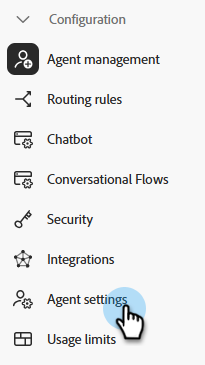
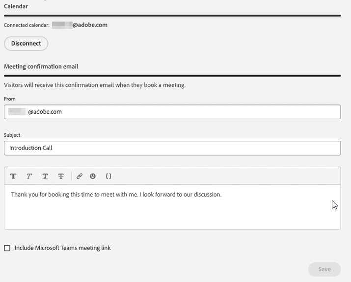

# Instellingen agent {#agent-settings}

Configureer uw agenda en stel de beschikbaarheid van vergaderingen/livechats in.

>[!PREREQUISITES]
>
>Zorg ervoor uw agenten aangewezen zijn verleend [machtigingen](/help/marketo/product-docs/demand-generation/dynamic-chat/setup-and-configuration/permissions.md){target="_blank"}.

## Connect-agenda {#connect-calendar}

In het de configuratietabblad van de Kalender, verbind uw Vooruitzichten of kalender van Gmail voor gebruik in afspraak die in het praatje plant.

Zodra de kalender van een gebruiker met Dynamic Chat wordt verbonden, zullen zij aan de rij worden toegevoegd en hun kalender zal voor websitebezoekers beschikbaar zijn om benoemingen te plannen op.

>[!NOTE]
>
>U kunt één kalender per gebruiker verbinden. Als u vergaderingen op veelvoudige kalenders wilt ontvangen, moet u veelvoudige gebruikers toevoegen en hen hebben elk hun kalenders verbinden.

De gebruikers kunnen het lichaam van de uitnodiging ook aanpassen die naar de bezoeker wordt verzonden wanneer zij een benoeming op de kalender van de gebruiker plannen. Ze kunnen ook het selectievakje onderaan inschakelen om een koppeling naar Google Meet of Microsoft Teams op te nemen (afhankelijk van de kalender die is verbonden).

>[!TIP]
>
>Gebruik het symbolische pictogram (krullende steunen) om uw vergadering te personaliseren die bevestigings e-mails gebruikend persoon of bedrijfattributen.

### Machtigingen {#permissions}

Het vormen met Vooruitzichten verleent de volgende toestemmingen aan Dynamic Chat:

* Volledige toegang tot uw kalenders
* Aanmelden en uw profiel lezen
* Toegang tot gegevens behouden waartoe u toegang hebt verleend
* Uw postvakmontages lezen

Als u configuratie uitvoert met Google, worden de volgende machtigingen aan de Dynamic Chat verleend:

* Kalenders maken, wijzigen of verwijderen
* Afzonderlijke kalendergebeurtenissen bijwerken
* Wijzig uw instellingen, inclusief wie uw gebeurtenissen kan zien
* Wijzigen met wie de kalender wordt gedeeld
* Toegang tot uw naam, e-mailadres, taalvoorkeur en profielafbeelding

## Beschikbaarheid van boekingen voor vergaderingen {#meeting-booking-availability}

Plaats uw tijdzone en tijd/dag van weekbeschikbaarheid om vergaderingsboekingen te ontvangen.

<table> 
 <tbody> 
  <tr> 
   <td><b>Duur van vergadering</b></td>
   <td>Hiermee bepaalt u de tijdsduur die bezoekers in de beschikbare vergaderruimten zien.</td>
  </tr> 
  <tr> 
   <td><b>Buffertijd tussen vergaderingen</b></td>
   <td>Tijd die u instelt als buffer voor na de vergadering. Als u het 30 minuten plaatst, zal niemand een vergadering met u tot 30 minuten na het geplande eind van een vergadering op uw kalender kunnen boeken.</td>
  </tr>
 </tbody> 
</table>

>[!TIP]
>
>U kunt meerdere blokken tijd selecteren op dezelfde dag (bijvoorbeeld vrijdag van 8a-12p) _en_ 1p-5p) door op de knop **+** teken aan de rechterkant.

## Live Chat-beschikbaarheid {#live-chat-availability}

Plaats uw tijdzone en tijd/dag van week beschikbaarheid om levende kartels te ontvangen.

Als u bent aangemeld bij de app, ontvangt u een melding in de app van een binnenkomende chat. Als u niet bent aangemeld, ontvangt u een browsermelding (als u [instellen](/help/marketo/product-docs/demand-generation/dynamic-chat/live-chat/agent-inbox.md#live-chat-notifications){target="_blank"}).

>[!IMPORTANT]
>
>De [beschikbaarheidsschakelaar](/help/marketo/product-docs/demand-generation/dynamic-chat/live-chat/agent-inbox.md#availability-toggle){target="_blank"} in de Agent Inbox **zal overschrijven** wat u invoert op het tabblad Beschikbaarheid van live chat. Dus als u zoals beschikbaar van 1p-5p gepland maar een snelle onderbreking bij 3p moet nemen, te hoeven u niet om uw agentenmontages te veranderen. De van de knevel van de beschikbaarheid status zal blijven tot u het manueel verandert, of tot het volgende tijdblok in uw beschikbaarheid wordt bereikt.

>[!TIP]
>
>U kunt meerdere blokken tijd selecteren op dezelfde dag (bijvoorbeeld vrijdag van 8a-12p) _en_ 1p-5p) door op de knop **+** teken aan de rechterkant.
