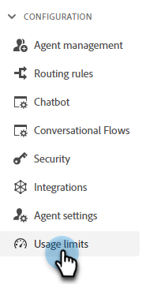

# Gebruiksbeperkingen {#usage-limits}

Ga naar de pagina Gebruikslimieten voor belangrijke informatie, zoals pakketinformatie en status van de gebruikslimiet.

1. Klik onder Configuratie op **[!UICONTROL Usage limits]**.

   

1. Bekijk uw huidige pakket, de status van de maandelijkse limiet voor gesprekken in kwestie en de status van de levenslange limiet voor licenties voor Kalender/Live Chat.

   

>[!NOTE]
>
>Maandelijkse limieten worden automatisch opnieuw ingesteld op de eerste van elke maand.
