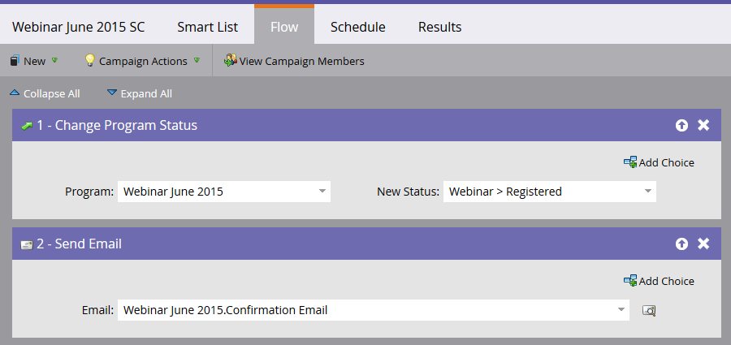

# Een gebeurtenis maken met [!DNL GotoWebinar] {#create-an-event-with-gotowebinar}

>[!PREREQUISITES]
>
>* [ voeg  [!DNL GoToWebinar]  toe als a  [!DNL LaunchPoint]  dienst ](/help/marketo/product-docs/administration/additional-integrations/add-gotowebinar-as-a-launchpoint-service.md)
>* [ creeer een Nieuw Programma van de Gebeurtenis ](/help/marketo/product-docs/demand-generation/events/understanding-events/create-a-new-event-program.md)
>* Plaats de aangewezen [ stroomacties ](/help/marketo/product-docs/core-marketo-concepts/smart-campaigns/flow-actions/add-a-flow-step-to-a-smart-campaign.md) om overeenkomst te volgen

Maak eerst uw webinar in [!DNL GoToWebinar] . Bepaalde instellingen bij het maken van uw [!DNL GoToWebinar] worden gebruikt door Marketo en sommige worden alleen gebruikt door [!DNL GoToWebinar] .

Nadat u een Marketo-gebeurtenis hebt gemaakt en de [!DNL GoToWebinar] hieraan hebt gekoppeld, kunnen de systemen gegevens over registratie en aanwezigheid delen.

Hieronder volgt een lijst met de instellingen die door Marketo worden gebruikt.

## Titel en beschrijving {#title-and-description}

**[!UICONTROL Title]** - voer de naam voor het webinar in. Deze naam wordt weergegeven in Marketo.

**[!UICONTROL Description]** (optioneel) - voer de beschrijving voor het webinar in. De beschrijving kan in Marketo worden weergegeven.

## Datum en tijd {#date-time}

Voer de volgende informatie in voor uw webinar en het wordt via de adapter in Marketo geplaatst. Als u wijzigingen aanbrengt in deze gegevens, moet u op de koppeling &quot;**[!UICONTROL Refresh from Webinar Provider]**&quot; onder **[!UICONTROL Event Actions]** klikken om de wijzigingen te kunnen zien.

**[!UICONTROL Start Date]** - voer uw begindatum in. Dit zal in Marketo kunnen worden bekeken.

**[!UICONTROL Start Time]** - voer uw begintijd in. Dit zal in Marketo kunnen worden bekeken.

**[!UICONTROL End Time]** - voer uw eindtijd in. Dit zal in Marketo kunnen worden bekeken.

**[!UICONTROL Webinar Time Zone]** - selecteer de toepasselijke tijdzone. Het zal in Marketo kunnen worden bekeken.

**[!UICONTROL Type]** - ingesteld op **[!UICONTROL One Session]** .

>[!NOTE]
>
>Marketo ondersteunt momenteel geen terugkerende webinars. U moet één sessie instellen tussen elke Marketo-gebeurtenis en [!DNL GoToWebinar] webinar.

>[!TIP]
>
>Als u extra [!DNL GoToWebinar] hulp nodig hebt, gelieve hun [ Plaats van de Hulp ](https://support.logmeininc.com/gotowebinar) te bezoeken.

Laten we nu naar Marketo springen!

1. Selecteer een gebeurtenis. Klik op **[!UICONTROL Event Actions]** en kies **[!UICONTROL Event Settings]** .

   

   >[!NOTE]
   >
   >Het kanaaltype van de geselecteerde gebeurtenis moet **webinar** zijn.

1. Kies **[!UICONTROL GoToWebinar]** in de lijst **[!UICONTROL Event Partner]** .

   

1. Kies het account.

   

1. Selecteer het webinar.

   

1. Klik op **[!UICONTROL Save]**.

   

1. Uitstekend! De gebeurtenis wordt nu gesynchroniseerd en gepland door **[!DNL GoToWebinar]** .

   

   >[!NOTE]
   >
   >De velden die Marketo verzendt, zijn: Voornaam, Achternaam, E-mailadres. Deze velden zijn verplicht en mogen niet leeg zijn.

   >[!TIP]
   >
   >Gebruik de volgende token in uw e-mail: `{{member.webinar url}}` om het bevestigingsbericht te vullen met deze unieke URL. Wanneer de bevestiging-URL wordt verzonden, wordt deze token automatisch omgezet in de unieke bevestiging-URL van de persoon.
   >
   >Plaats uw bevestigingse-mail aan **Operationeel** om ervoor te zorgen dat de mensen die registreren en kunnen worden afgemeld nog hun bevestigingsinformatie ontvangen.

   

   >[!CAUTION]
   >
   >Vermijd het gebruik van geneste e-mailprogramma&#39;s voor het verzenden van bevestigingsberichten. Gebruik in plaats hiervan de slimme campagne van het gebeurtenisprogramma, zoals hierboven wordt getoond.

   >[!TIP]
   >
   >Het kan tot 48 uur duren voordat de gegevens in Marketo verschijnen. Als u na het wachten op deze tijd nog steeds niets ziet, selecteert u **[!UICONTROL Refresh from Webinar Provider]** in het menu [!UICONTROL Event Actions] op het tabblad **[!UICONTROL Summary]** van de gebeurtenis.

Personen die zich aanmelden voor uw webinar, worden via de [!UICONTROL Change Program Status] flowstap naar uw webinar gestuurd wanneer [!UICONTROL New Status] is ingesteld op &quot;Geregistreerd&quot;. Geen andere status zal de persoon over duwen. Zorg er ook voor dat u [!UICONTROL Change Program Status] stap #1 en [!UICONTROL Send Email] stap #2 uitvoert.

## Het overzicht weergeven  {#viewing-the-schedule}

Klik in de programmaweergave van het programma op de kalendervermelding voor de gebeurtenis. U kunt het schema aan de rechterkant van het scherm zien.

>[!NOTE]
>
>Als u het gebeurtenissenschema wilt wijzigen, moet u het webinar bewerken op [!DNL GoToWebinar] .

