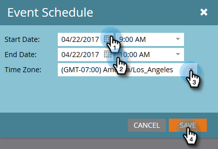

# Gebeurtenisinstellingen configureren en Marketo synchroniseren met uw webinar {#configure-event-settings-and-sync-marketo-with-your-webinar}

Voer de volgende stappen uit om de Marketo-gebeurtenisinstellingen te configureren en Marketo en ON24 te verbinden.

## De gebeurtenis instellen {#set-the-event}

1. Kies de gebeurtenis die u aan een ON24-webinar wilt koppelen, klik vervolgens op de vervolgkeuzelijst **[!UICONTROL Event Actions]** en selecteer **[!UICONTROL Event Settings]** .

   

1. Selecteer ON24 als [!UICONTROL Event Partner].

   

1. Selecteer de [!UICONTROL Login] -account (bijvoorbeeld de weergavenaam).

   

1. Voer de waarde [!UICONTROL Event Id] in (ontvang deze waarde op ON24). Klik op **[!UICONTROL Save]**.

   

   >[!NOTE]
   >
   >Tijdens piektijden kan het 15 tot 20 minuten duren voor ON24 de gebeurtenisinformatie beschikbaar maakt voor Marketo. Als u het bericht &#39;Ongeldige sessie-id&#39; ontvangt, probeert u het later opnieuw.

## Het schema instellen {#set-the-schedule}

Wanneer u opstelling een gebeurtenis die met een ON24 Webinar wordt geassocieerd, bevolkt het gebeurtenisprogramma met gegevens van ON24. Voer de volgende stappen uit om het dialoogvenster [!UICONTROL Event Schedule] te openen.

1. Selecteer de gebeurtenis. Klik op de vervolgkeuzelijst **[!UICONTROL Event Actions]** en selecteer **[!UICONTROL Schedule].**

   

1. Kies de **[!UICONTROL Start Date]** , **[!UICONTROL End Date]** en **[!UICONTROL Time Zone]** . Klik op **[!UICONTROL Save]**.

   

   >[!NOTE]
   >
   >Als u gebeurtenisinformatie bijwerkt in ON24, moet u **[!UICONTROL Refresh from Webinar Provider]** in het [!UICONTROL Event Actions] menu klikken om de nieuwe gegevens te zien vullen.

Nu kunt u zich op de volgende stap bewegen: [ creërend kindcampagnes en lokale activa ](/help/marketo/product-docs/demand-generation/events/create-an-event/create-an-event-with-the-marketo-on24-adapter/create-child-campaigns-and-local-assets.md){target="_blank"}.

>[!MORELIKETHIS]
>
>[ Begrip Marketo On24 adaptergebeurtenissen ](/help/marketo/product-docs/demand-generation/events/create-an-event/create-an-event-with-the-marketo-on24-adapter/understanding-marketo-on24-adapter-events.md){target="_blank"}
