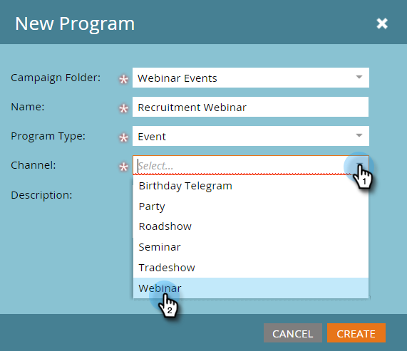

# Voorbeeld ON24-gebeurtenisintegratie {#example-on-event-integration}

Hier is een voorbeeldgebeurtenis, inclusief campagnes, voor een ON24 webinar. Wanneer u uw gebeurtenis maakt, moet u uw campagnes testen voordat u deze uitvoert.

## Nieuwe gebeurtenis maken in marketingactiviteiten {#create-a-new-event-in-marketing-activities}

1. Selecteer **[!UICONTROL New]** > **[!UICONTROL New Program]** .

   

1. Selecteer een **[!UICONTROL Campaign Folder]** locatie waar de gebeurtenis plaatsvindt.

   

1. Voer een **[!UICONTROL Name]** in voor de gebeurtenis.

   

1. Selecteer **[!UICONTROL Event]** als de **[!UICONTROL Program Type]** .

   

1. Selecteer **[!UICONTROL Webinar]** als de **[!UICONTROL Channel]** voor de gebeurtenis.

   

1. Klik op **[!UICONTROL Create]**.

   

## Uitnodigen (batchcampagne)  {#invite-batch-campaign}

* **Slimme Lijst** - bepaal wie u aan de gebeurtenis zult uitnodigen.
* **Stroom**

   * E-mail verzenden - Als dit een e-mail met lokale middelen is, heeft deze de volgende naamgevingsconventie: EventName.EmailName. Je kunt ook wereldwijde e-mails gebruiken.
   * Status wijzigen in Progressie - Instellen op Webinar > Uitgenodigd.

* **Programma** - plaats de datum voor de te verzenden uitnodiging.

## Registratie/bevestiging (Trigger-campagne) {#registration-confirmation-trigger-campaign}

* **Slimme Lijst**

   * Trigger de campagne die op **[!UICONTROL Fills Out Form]** wordt gebaseerd. Zorg ervoor dat u de landingspagina opneemt waarop het formulier zich bevindt door **[!UICONTROL Add Constraint]** te gebruiken, vooral als het formulier wordt gebruikt op meerdere bestemmingspagina&#39;s.

>[!CAUTION]
>
>U moet een Marketo-formulier gebruiken om personen voor de gebeurtenis te registreren, of een niet-Marketo-formulier met de juiste API-integratie om registratiegegevens naar Marketo te verzenden. Dit is essentieel voor het succes van uw [!UICONTROL Event Partner] integratie. **NOTA**: Als u een vorm van Marketo op een niet-Marketo landende pagina gebruikt, zal uw trekker **[!UICONTROL Fills Out Form]** met [!UICONTROL Form Name] zijn.

* **Stroom**

   * **Status van de Verandering in Progressie** - reeks aan Webinar > Geregistreerd. **VOORZIENING**: Deze stroomstap wordt vereist wanneer vestiging uw kindcampagne. Wanneer de vooruitgangsstatus van een persoon in **Geregistreerde** verandert, drukt Marketo de registratieinformatie aan ON24.

   * **verzend E-mail** - Bevestiging e-mail (geplaatst aan **Operationeel** zodat unsubscribed mensen die nog het hebben geregistreerd ontvangen).

**NOTA**: Als de persoon met een registratiefout is teruggekeerd, zullen zij niet de e-mailbevestiging ontvangen.

## Herinnering (batchcampagne) {#reminder-batch-campaign}

* **Slimme Lijst** - filter gebruikend **Lid van Programma** en plaats de status aan **Geregistreerd**.

* **Stroom** - verzend E-mail (Herinnering E-mail).

**NOTA**: U kon een gelijkaardige campagne gebruiken om a *verschillende* follow-up e-mail naar mensen te verzenden die werden uitgenodigd maar nog niet geregistreerd.

## Follow-upcampagne (campagne voor batchverwerking of activering) {#follow-up-campaign-batch-or-trigger-campaign}

* **Slimme Lijst** - Trekker die op veranderingen in programmastatus wordt gebaseerd.

* **Stroom** - verzend E-mail. Gebruik keuzen om verschillende e-mails te verzenden op basis van de status van het programma.

>[!MORELIKETHIS]
>
>[ Begrip Marketo ON24 adaptergebeurtenissen ](/help/marketo/product-docs/demand-generation/events/create-an-event/create-an-event-with-the-marketo-on24-adapter/understanding-marketo-on24-adapter-events.md){target="_blank"}
