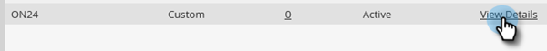
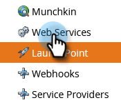

# De ON24-integratie met Marketo instellen{#set-up-the-on24-integration-with-marketo}

Hier is hoe te opstelling uw ON24 gebeurtenisintegratie.

## Een alleen-API rol maken {#create-an-api-only-role}

1. Klik in Mijn Marketo op **[!UICONTROL Admin]** .

   

1. Klik onder [!UICONTROL Security] op **[!UICONTROL Users & Roles]** .

   

1. Klik op de tab **[!UICONTROL Roles]** en vervolgens op **[!UICONTROL New Role]** .

   

1. Voer een [!UICONTROL Role Name] in. Open het **[!UICONTROL Access API]** menu en selecteer &quot;[!UICONTROL Read-Write Custom Object]&quot; en &quot;[!UICONTROL Read-Write Person]&quot;. Klik op **[!UICONTROL Create]**.

   

## Een nieuwe gebruiker maken {#create-a-new-user}

1. Blijf in [!UICONTROL Users & Roles], klik het **[!UICONTROL Users]** lusje en klik **[!UICONTROL Invite New User]**.

   

1. Voer de gegevens van de nieuwe gebruiker in en klik op **[!UICONTROL Next]** .

   

1. Selecteer de [!UICONTROL ON24 API Only Role (all workspaces)] die u net hebt gemaakt. Schakel het selectievakje **[!UICONTROL API Only]** in. Klik op **[!UICONTROL Next]**.

   

1. Klik op **[!UICONTROL Send]**.

   

>[!NOTE]
>
>Een uitnodiging is niet vereist voor alleen API-gebruikers.

## ON24-verbinding instellen {#set-up-on24-connection}

1. Klik nog steeds in de sectie [!UICONTROL Admin] op **[!UICONTROL LaunchPoint]** .

   

1. Klik op **[!UICONTROL New]** en vervolgens op **[!UICONTROL New Service]** .

   

1. Kies een [!UICONTROL display name] . Klik op de vervolgkeuzelijst **[!UICONTROL Service]** en selecteer **[!UICONTROL Custom]** . Voer een [!UICONTROL description] in. Klik [!UICONTROL API Only User] drop-down en selecteer de gebruiker u [ in de stappen hierboven ](#create-a-new-user) creeerde. Klik op **[!UICONTROL Create]**.

   

1. Zoek de aangepaste [!DNL LaunchPoint] -service die u net hebt gemaakt en klik op [!UICONTROL View Details] .

   

1. Markeer, klik met de rechtermuisknop, kopieer en sla de [!UICONTROL Client ID] op (u hebt deze later nodig). Herhaal deze bewerking voor [!UICONTROL Client Secret] .

   

1. Klik in de boomstructuur links op **[!UICONTROL Web Services]** .

   

1. Onder &quot;[!UICONTROL REST API],&quot;hoogtepunt, klik met de rechtermuisknop aan, kopieer en bewaar het eerste deel van [!UICONTROL Identity] (tot &quot;m&quot;in .com).

   

1. Navigeer met uw opgeslagen client-id, clientgeheim en identiteit naar uw ON24-account. De rest stappen worden daar uitgevoerd, en kunnen in de [ documentatie ON24 ](https://support.on24.com/hc/en-us/articles/21420762650523-Data-Integration-Setup-Instructions-When-Using-Marketo-Registration-Option-1){target="_blank"} worden gevonden.
