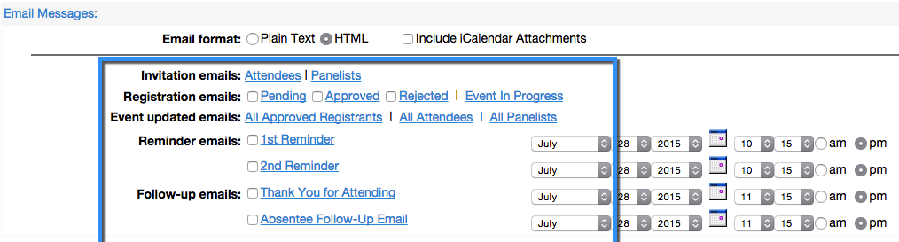

# Een gebeurtenis maken met Webex {#create-an-event-with-webex}

>[!PREREQUISITES]
>
>* [Webex toevoegen als een LaunchPoint-service](/help/marketo/product-docs/administration/additional-integrations/add-webex-as-a-launchpoint-service.md)
>* [Een nieuw gebeurtenisprogramma maken](/help/marketo/product-docs/demand-generation/events/understanding-events/create-a-new-event-program.md)
>* Stel de juiste [flowhandelingen](/help/marketo/product-docs/core-marketo-concepts/smart-campaigns/flow-actions/add-a-flow-step-to-a-smart-campaign.md) om betrokkenheid bij te houden
>* Zorg ervoor u de (klassieke) Gebeurtenissen van Webex gebruikt

Maak eerst een webinar in [Webex](https://www.webex.com/){target="_blank"}. Event in the Webex Event Center. Marketo only uses specific settings and fields for your integration, which we'll go through shortly. Other fields that you might want to configure for Webex are explained in the [Webex Event Center User Guide](https://www.cisco.com/c/dam/en/us/td/docs/collaboration/meeting_center/wbs298/wx_ec_host_ug.pdf){target="_blank"}.

>[!IMPORTANT]
>
>Marketo Engage ondersteunt alleen gebeurtenissen die zijn gemaakt in Webex Events (klassiek). Marketo biedt momenteel geen ondersteuning voor gebeurtenissen die zijn gemaakt in Webex Events (new).

## Basisinformatie {#basic-information}

* **Naam gebeurtenis -** Deze naam wordt weergegeven in Marketo.
* **Selectievakje voor Niet-weergegeven**

   * Het wordt aanbevolen **niet** maak een lijst van uw gebeurtenis. Hiermee zorgt u ervoor dat alle personen zich registreren via de Marketo-landingspagina. Personen die zich via een ander mechanisme dan Marketo registreren, worden in Marketo weergegeven nadat de gebeurtenis is voltooid EN alleen als zij de gebeurtenis hebben bijgewoond.
   * Als u ervoor kiest om de gebeurtenis weer te geven, wordt deze op de pagina Lijst met gebeurtenissen weergegeven voor iedereen die de website van het gebeurteniscentrum bezoekt.

* **Registratie -** Schakel dit selectievakje in als u &quot;required&quot; wilt instellen. U gebruikt een Marketo-formulier-/landingspagina om registratiegegevens vast te leggen die naar Webex worden verzonden.
* **Wachtwoord voor gebeurtenis**- (optioneel) Als u dit veld gebruikt, moet u het in uw bevestigingsbericht opnemen.

## Datum en tijd {#date-time}

* **Begindatum** - Voer uw begindatum in. Dit zal in Marketo kunnen worden bekeken.

* **Begintijd** - Voer uw begintijd in. Dit zal in Marketo kunnen worden bekeken.

* **Geschatte duur** - Geef de duur van de gebeurtenis op. Dit zal in Marketo kunnen worden bekeken.

* **Tijdzones** - Voer de toepasselijke tijdzones in. Ze zullen in Marketo kunnen worden bekeken.

## Instellingen audioconferentie {#audio-conference-settings}

Deze instellingen bevinden zich alleen in Webex. Ze worden niet gebruikt door of kunnen niet worden bekeken in Marketo, maar ze kunnen wel belangrijk zijn voor je webinar, dus dubbelcontroleer ze!

## Beschrijving en opties van gebeurtenis  {#event-description-options}

De volgende opties worden gebruikt door of kunnen worden weergegeven in Marketo. Andere velden zijn alleen beschikbaar in Webex.

* **Beschrijving** - Voer een beschrijving in. Dit zal in Marketo kunnen worden bekeken maar niet kunnen worden gewijzigd.
* **Onderzoek na de gebeurtenis** - Marketo kan de informatie op dit moment niet vastleggen in een Webex-enquête na de gebeurtenis.
* **Doel-URL** - (optioneel) U kunt de URL van een Marketo-bestemmingspagina invoeren om te dienen als de doel-URL om na afloop van de sessie weer te geven.

## Aanwezigen en registratie {#attendees-registration}

U bestuurt de uitnodigingslijst, het registratieformulier en andere e-mails met een Marketo-gebeurtenis. Andere functionaliteit wordt niet ondersteund door Marketo, zoals:

* **Maximum aantal registranten** - Momenteel **niet** ondersteund met de Marketo-Webex-integratie.  Handmatige goedkeuring van registranten is beschikbaar met de status In afwachting van goedkeuring in Marketo.

* **Registratie-id is vereist** - Wordt momenteel ondersteund met de integratie tussen Marketo en Webex. Met Marketo kunt u het bevestigingsbericht voor uw gebeurtenis verzenden. Wanneer de persoon zich registreert, ontvangen hij een unieke URL die hij of zij gebruikt om de gebeurtenis in te voeren.

  >[!TIP]
  >
  >Als u het bevestigingsbericht met deze unieke URL wilt vullen, gebruikt u de volgende token in uw e-mail: `{{member.webinar url}}`. Wanneer de bevestiging-URL wordt verzonden, wordt deze token automatisch omgezet in de unieke bevestiging-URL van de persoon.
  >
  >Stel het bevestigingsbericht in op **Operationeel** om ervoor te zorgen dat personen die zich inschrijven en eventueel worden afgemeld, nog steeds hun bevestigingsinformatie ontvangen.

* **Registratiewachtwoord** - (Optioneel) Wordt momenteel niet ondersteund met de Marketo-Webex-integratie.
* **Goedkeuringsregels** - Wordt momenteel niet ondersteund met de Marketo-Webex-integratie. U kunt echter slimme campagnes in Marketo gebruiken om goedkeuringen te beheren.

### Presentatoren en panelleden {#presenters-panelists}

De informatie die in deze sectie wordt gevormd wordt niet overgegaan tot Marketo.

### E-mailberichten {#email-messages}

Met Marketo kunt u e-mails, bevestigingse-mails en dergelijke naar uw geregistreerde personen sturen. U hoeft niets in deze sectie te configureren. Schakel de e-mailberichtopties in Webex uit (hef de controle ongedaan).

>[!NOTE]
>
>De Marketo-Webex-integratie biedt geen ondersteuning voor het verzenden van bevestigingse-mails vanuit Webex. De bevestiging moet via Marketo worden verzonden. Nadat u de gebeurtenis hebt gepland, kopieert u de gebeurtenisinformatie naar het bevestigingsbericht van Marketo en stelt u het e-mailbericht in als **Operationeel**.

Nu zijn we klaar om naar Marketo te springen!

1. Selecteer de gebeurtenis die u hebt gemaakt. Open de **Gebeurtenishandelingen** vervolgkeuzelijst. Kies **Gebeurtenisinstellingen.**

   

   >[!NOTE]
   >
   >Het kanaaltype van de geselecteerde gebeurtenis moet zijn **webinar**.

1. Onder **Gebeurtenispartner**, selecteert u **Webex**.

   

1. Onder **Aanmelden**, kiest u uw Webex-aanmelding.

   

1. Onder **Gebeurtenis** kiest u de zojuist gemaakte Webex-gebeurtenis. Selecteer vervolgens een optionele back-uppagina en klik op **Opslaan**.

   

1. Selecteer een optionele back-uppagina voor uw Webex-gebeurtenis. Kies een optie in de vervolgkeuzelijst met goedgekeurde Marketo-bestemmingspagina&#39;s of voer de URL in van een landingspagina die geen Marketo is.

   >[!TIP]
   >
   >Stel een back-uppagina in om een lid naar een specifieke pagina te leiden als het vóór de begintijd van de gebeurtenis op de URL van de aangepaste gebeurtenis klikt.

   >[!NOTE]
   >
   >De velden die Marketo verzendt, zijn: Voornaam, Achternaam, E-mailadres.

   

   >[!CAUTION]
   >
   >Vermijd het gebruik van geneste e-mailprogramma&#39;s voor het verzenden van bevestigingsberichten. Gebruik in plaats hiervan de slimme campagne van het gebeurtenisprogramma, zoals hierboven wordt getoond.

   >[!TIP]
   >
   >Het kan tot 48 uur duren voordat de gegevens in Marketo verschijnen. Als u na het wachten nog steeds niets ziet, selecteert u **Vernieuwen vanaf webinar-provider** in het menu Gebeurtenishandelingen in het dialoogvenster **Samenvatting** tabblad van uw gebeurtenis.

Zoet! Uw Webex-gebeurtenis wordt nu gesynchroniseerd met uw Marketo-gebeurtenis. Personen die zich aanmelden voor uw webinar, worden via de stap Program Status wijzigen naar uw webinar geduwd wanneer de Nieuwe status is ingesteld op &quot;Geregistreerd&quot;. Geen andere status zal de persoon over duwen. Zorg er ook voor dat u in stap 1 van de statusstroom van het programma Wijzigen en stap 2 in de E-mailflow verzendt.

## Het overzicht weergeven  {#viewing-the-schedule}

Klik in de programmaweergave van het programma op de kalendervermelding voor de gebeurtenis. U kunt het schema aan de rechterkant van het scherm zien!

>[!NOTE]
>
>Als u uw gebeurtenissenschema wilt wijzigen, moet u het webinar op Webex bewerken.
