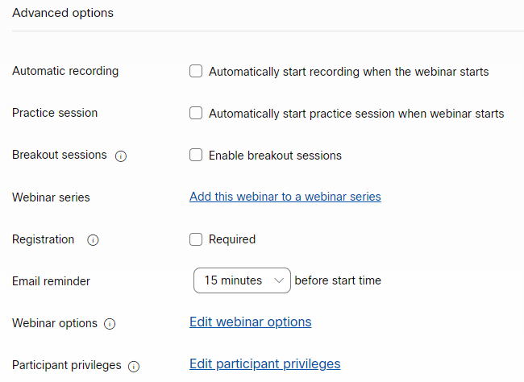
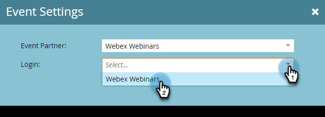

# Een gebeurtenis maken met [!DNL Webex] {#create-an-event-with-webex}

Nadat u een webinar in Webex creeert, zult u uw gebeurtenis met Marketo Engage moeten synchroniseren.

>[!PREREQUISITES]
>
>* [ voeg  [!DNL Webex]  als a [!DNL LaunchPoint]  Dienst ](/help/marketo/product-docs/administration/additional-integrations/add-webex-as-a-launchpoint-service.md) toe
>* [ creeer een Nieuw Programma van de Gebeurtenis ](/help/marketo/product-docs/demand-generation/events/understanding-events/create-a-new-event-program.md)
>* Plaats de aangewezen [ stroomacties ](/help/marketo/product-docs/core-marketo-concepts/smart-campaigns/flow-actions/add-a-flow-step-to-a-smart-campaign.md) om overeenkomst te volgen

## Uw webinar plannen {#schedule-your-webinar}

U plant uw gebeurtenis en kiest uw aangewezen montages in [ Webex ](https://www.webex.com/){target="_blank"}. Alleen de volgende informatie kan in Marketo worden weergegeven: naam webinar, begin-/einddatum en -tijd, tijdzone en beschrijving. De extra informatie over Webex Webinars [ kan hier ](https://help.webex.com/en-us/landing/ld-7srxjs-WebexWebinars/Webex-Webinars){target="_blank"} worden gevonden.

### Basisinformatie {#basic-information}

* **[!UICONTROL Event Name]-** Deze naam wordt weergegeven in Marketo.
* **[!UICONTROL Unlisted Checkbox]**
* **Onderwerp**: Dit is uw gebeurtenisnaam en zal in Marketo viewable zijn.
* **Datum en tijd**: Begin/einddatum, begin/eindtijd, duur, en tijdzone zijn allen viewable in Marketo.
* **Maximale aanwezigen**: Het maximumaantal aanwezigen bepaalt welke eigenschappen Webex worden gesteund.
* **Webcast mening voor aanwezigen**: Controleer dit om uw webinar te hebben levend aan alle aanwezigen stromen.
* **Panelists**: Nodig specifieke mensen uit om panelleden op uw webinar te zijn.
* **Webinar agenda**: bevolk dit als u context in de e-mailuitnodiging wilt verstrekken die naar panelleden wordt verzonden.

### Beveiliging {#security}

* **Webinar wachtwoord**: (facultatief) als u dit gebied gebruikt, ben zeker om het in uw bevestigingsmail te omvatten.
* **wachtwoord Panelist**: (facultatief) als u dit gebied gebruikt, ben zeker om het in uw Webinar agenda te omvatten.
* **vereist rekening**: Beperkt aanwezigen tot slechts die die rekeningen hebben Webex.

### Opties voor audioverbinding {#audio-connection-options}

* **Audio verbindingstype**: Kies hoe de webinar deelnemers zich bij het audiogedeelte van uw webinar aansluiten.
* **Ingang en uitgangstoon**: Selecteer het geluid u gebruikers wilt wanneer iemand webinar (vereiste telefoonaudioverbinding) ingaat of weggaat.
* **Dempen panelist**: Kies uw gewenste montages van de panelist dempen.

### Geavanceerde opties {#advanced-options}

* **Automatische opname**: Controleer dit om uw webinar automatisch te hebben geregistreerd.
* **zitting van de Praktijk**: Controleer dit om een praktijkzitting te hebben begonnen wanneer webinar begint.
* **de zittingen van de Brainstormsessie**: De zittingen van de Brainstormsessie staan u toe om panelleden en aanwezigen vooraf toe te wijzen alvorens webinar begint, of hen toe te staan om zich bij tijdens webinar aan te sluiten.
* **Webinar reeksen**: Het toevoegen aan een webinar reeks laat mensen uw webinar zien of het openbaar of niet is.
* **Registratie**: Vereist aanwezigen om gastheergoedkeuring te registreren en te ontvangen alvorens het bijwonen.
* **E-mailherinnering**: Kies een e-mailherinnering die zich van 15 minuten uitstrekken alvorens webinar tot twee dagen begint.
* **Webinar opties**: Bepaal welke eigenschappen aan deelnemers in webinar beschikbaar zijn.
* **de voorrechten van de Deelnemer**: De voorrechten van de Deelnemer bepalen de acties beschikbaar aan webinar deelnemers.

>[!NOTE]
>
>De Marketo-Webex-integratie biedt geen ondersteuning voor het verzenden van bevestigingse-mails vanuit Webex. De bevestiging moet via Marketo worden verzonden. Nadat u de gebeurtenis hebt gepland, ben zeker om de gebeurtenisinformatie aan de bevestigingse-mail van Marketo te kopiëren en e-mail te plaatsen als _Operationeel_.

## Uw gebeurtenis synchroniseren met Marketo Engage {#sync-your-event-with-marketo-engage}

1. Zoek en selecteer het gewenste gebeurtenisprogramma in Marketo. In de **drop-down Acties van de Gebeurtenis**, uitgezochte **Montages van de Gebeurtenis**.

   

   >[!NOTE]
   >
   >Het kanaaltype van de geselecteerde gebeurtenis moet **webinar** zijn.

1. In de **drop-down Van de Partner van de Gebeurtenis 0}, uitgezochte** Webex Webinars **.**

   

1. In de **Login** drop-down, kies uw login van Webex.

   

1. In **gebeurtenis** drop-down, kies uw gebeurtenis Webex.

   

1. Uw webinar details zullen bevolken. Klik **sparen**.

   

Uw Webex-gebeurtenis wordt nu gesynchroniseerd met uw Marketo-gebeurtenisprogramma. De mensen die omhoog voor uw webinar ondertekenen zullen worden geduwd aan uw webinar leverancier via de _de stroomstap van de Status van het Programma van de Verandering_ wanneer de nieuwe status aan &quot;Geregistreerd wordt geplaatst.&quot; Geen andere status zal de persoon over duwen. Ben zeker om _stroomstap #1 van de Status van het Programma van de Verandering te maken_, en _verzendt e-mail_ stroomstap #2.

## Notities {#things-to-note}

* Vermijd het gebruik van geneste e-mailprogramma&#39;s voor het verzenden van bevestigingsberichten. Gebruik in plaats hiervan de slimme campagne van het gebeurtenisprogramma.

* Het kan tot 48 uur duren voordat gegevens in Marketo worden weergegeven. Als na het wachten dat lang u nog om het even wat ziet, **verfrist zich van Leverancier Webinar** in de **drop-down Acties van de Gebeurtenis** in het **Summiere** lusje van uw Programma van de Gebeurtenis.
