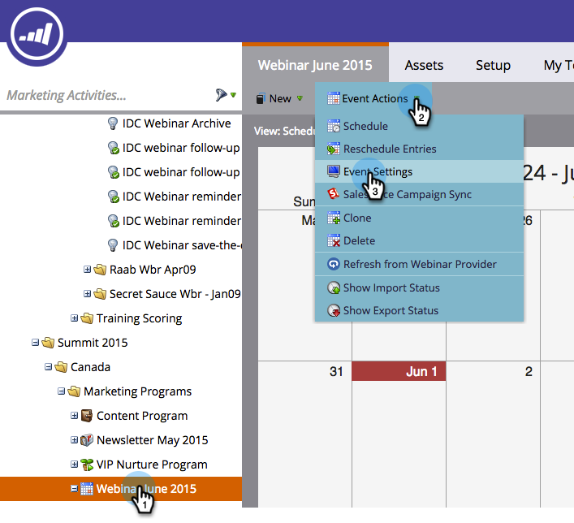

# Een gebeurtenis maken met [!DNL Zoom] {#create-an-event-with-zoom}

>[!PREREQUISITES]
>
>* [&#x200B; voeg  [!DNL Zoom]  als a [!DNL LaunchPoint]  Dienst &#x200B;](/help/marketo/product-docs/administration/additional-integrations/add-zoom-as-a-launchpoint-service.md) toe
>* [&#x200B; creeer een Nieuw Programma van de Gebeurtenis &#x200B;](/help/marketo/product-docs/demand-generation/events/understanding-events/create-a-new-event-program.md)
>* Plaats de aangewezen [&#x200B; stroomacties &#x200B;](/help/marketo/product-docs/core-marketo-concepts/smart-campaigns/flow-actions/add-a-flow-step-to-a-smart-campaign.md) om overeenkomst te volgen

Maak eerst uw webinar in [!DNL Zoom] . Bepaalde instellingen bij het maken van uw [!DNL Zoom] worden gebruikt door Marketo en sommige worden alleen gebruikt door [!DNL Zoom] .

Nadat u een Marketo-gebeurtenis hebt gemaakt en er een [!DNL Zoom] webinar aan hebt gekoppeld, kunnen de systemen registratie- en aanwezigheidsgegevens delen. Voor hulp die tot webinar leiden, zie [&#x200B; Begonnen het worden met  [!DNL Zoom]  Webinars &#x200B;](https://support.zoom.us/hc/en-us/articles/200917029-Getting-Started-With-Webinar).

Voer de volgende informatie in voor uw webinar en het wordt via de adapter in Marketo geplaatst. Als u wijzigingen aanbrengt aan deze gegevens, moet u onder Gebeurtenishandelingen op de koppeling &quot;Vernieuwen van webinar-provider&quot; klikken om de wijzigingen te kunnen zien.

**Titel en Beschrijving**

* **Webinar Naam** - ga de naam voor webinar in. Deze naam wordt weergegeven in Marketo.

* **Beschrijving** (facultatief) - ga de beschrijving voor webinar in. De beschrijving kan in Marketo worden weergegeven.

**Datum &amp; Tijd**

* **begindatum** - ga uw begindatum in. Dit zal in Marketo kunnen worden bekeken.

* **tijd van het Begin** - ga uw begintijd in. Dit zal in Marketo kunnen worden bekeken.

* **Duur** - ga de duur in. De begin- en eindtijd kunnen in Marketo worden weergegeven.

* **Tijdzone van de Tijd** - selecteer de toepasselijke tijdzone. Dit zal in Marketo kunnen worden bekeken.

* **Terugkomende Webinar** - houd ongecontroleerd.

* **Registratie** - controleer deze doos om registratie te maken vereist. U gebruikt een Marketo-formulier-/landingspagina om registratiegegevens vast te leggen die naar [!DNL Zoom] worden geduwd.

>[!NOTE]
>
>Marketo ondersteunt momenteel geen terugkerende webinars. U moet één sessie instellen tussen elke Marketo-gebeurtenis en [!DNL Zoom] webinar.

>[!TIP]
>
>Er zijn aanvullende velden die u configureert in [!DNL Zoom] en die GEEN invloed hebben op de integratie. Gelieve te verwijzen naar het [[!DNL Zoom]  Centrum van de Hulp Webinar &#x200B;](https://support.zoom.us/hc/en-us/sections/200324965-Video-Webinar) voor extra informatie over deze gebieden.

Laten we nu naar Marketo springen!

1. Selecteer een gebeurtenis. Klik op **[!UICONTROL Event Actions]** en kies **[!UICONTROL Event Settings]** .

   

   >[!NOTE]
   >
   >Het kanaaltype van de geselecteerde gebeurtenis moet **webinar** zijn.

1. Kies **[!UICONTROL Zoom]** in de lijst **[!UICONTROL Event Partner]** .

   

1. Kies de [!DNL Zoom] -account waaraan u de gebeurtenis wilt koppelen.

   

1. Selecteer het webinar.

   

1. Klik op **[!UICONTROL Save]**.

   

   Uitstekend! De gebeurtenis wordt nu gesynchroniseerd en gepland door [!DNL Zoom] .

   >[!NOTE]
   >
   >De velden die Marketo verzendt, zijn: Voornaam, Achternaam, E-mailadres.

   >[!TIP]
   >
   >Gebruik de volgende token in uw e-mail: `{{member.webinar url}}` om het bevestigingsbericht te vullen met deze unieke URL. Wanneer de bevestiging-URL wordt verzonden, wordt deze token automatisch omgezet in de unieke bevestiging-URL van de persoon.
   >
   >Plaats uw bevestigingse-mail aan **Operationeel** om ervoor te zorgen dat de mensen die registreren en kunnen worden afgemeld nog hun bevestigingsinformatie ontvangen.

   Personen die zich aanmelden voor uw webinar, worden via de **[!UICONTROL Change Program Status]** flowstap naar uw webinar gestuurd wanneer [!UICONTROL New Status] is ingesteld op &quot;Geregistreerd&quot;. Geen andere status zal de persoon over duwen. Zorg er ook voor dat u **[!UICONTROL Change Program Status]** stap #1 en **[!UICONTROL Send Email]** stap #2 uitvoert.

   

   >[!CAUTION]
   >
   >Vermijd het gebruik van geneste e-mailprogramma&#39;s voor het verzenden van bevestigingsberichten. Gebruik in plaats hiervan de slimme campagne van het gebeurtenisprogramma, zoals hierboven wordt getoond.

   >[!TIP]
   >
   >Het kan tot 48 uur duren voordat de gegevens in Marketo verschijnen. Als na het wachten dat lang u nog om het even wat ziet, **verfrist zich van Leverancier Webinar** van het menu van de Acties van de Gebeurtenis in het **Summiere** lusje van uw gebeurtenis, dan klikt verfrist pictogram op het bodemrecht van het scherm.
