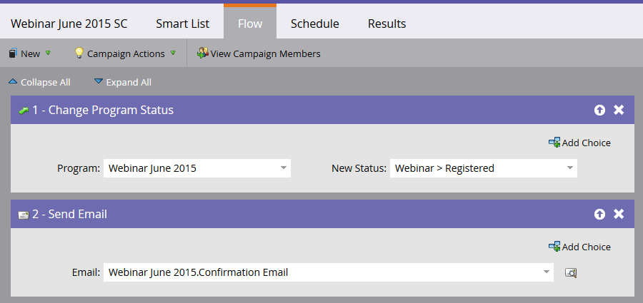

# Een gebeurtenis met zoomen maken {#create-an-event-with-zoom}

>[!PREREQUISITES]
>
>* [Zoomen toevoegen als een opstartpuntservice](/help/marketo/product-docs/administration/additional-integrations/add-zoom-as-a-launchpoint-service.md)
* [Een nieuw gebeurtenisprogramma maken](/help/marketo/product-docs/demand-generation/events/understanding-events/create-a-new-event-program.md)
* Stel de juiste [flowhandelingen](/help/marketo/product-docs/core-marketo-concepts/smart-campaigns/flow-actions/add-a-flow-step-to-a-smart-campaign.md)in om de betrokkenheid bij te houden

Maak eerst uw webinar in Zoomen. Bepaalde instellingen bij het maken van zoomen worden gebruikt door Marketo en sommige worden alleen gebruikt door Zoomen.

Nadat u een Marketo-gebeurtenis hebt gemaakt en een zoomwebinar hebt gekoppeld, kunnen de systemen gegevens over registratie en aanwezigheid delen. Zie [Aan de slag met webinars](https://support.zoom.us/hc/en-us/articles/200917029-Getting-Started-With-Webinar) voor hulp bij het maken van een webinar.

Voer de volgende informatie in voor uw webinar en het wordt via de adapter in Marketo geplaatst. Als u wijzigingen aanbrengt aan deze gegevens, moet u onder Gebeurtenishandelingen op de koppeling &quot;Vernieuwen van webinar-provider&quot; klikken om de wijzigingen te kunnen zien.

**Titel en beschrijving**

* **Webinar Naam**  - ga de naam voor webinar in. Deze naam wordt weergegeven in Marketo.

* **Beschrijving**  (optioneel) - Voer de beschrijving van het webinar in. De beschrijving kan in Marketo worden weergegeven.

**Datum en tijd**

* **Begindatum**  - Voer uw begindatum in. Dit zal in Marketo kunnen worden bekeken.

* **Begintijd**  - Voer uw begintijd in. Dit zal in Marketo kunnen worden bekeken.

* **Duur**  - Voer de duur in. De begin- en eindtijd kunnen in Marketo worden weergegeven.

* **Tijdzone**  - Selecteer de toepasselijke tijdzone. Dit zal in Marketo kunnen worden bekeken.

* **Herhalend Webinar** - Laat het selectievakje los.

* **Registratie**  - Schakel dit selectievakje in om registratie verplicht te stellen. U gebruikt een Marketo-formulier/landingspagina om registratiegegevens vast te leggen die naar Zoomen worden geduwd.

>[!NOTE]
Marketo biedt momenteel geen ondersteuning voor terugkerende webinars. U moet één sessie instellen tussen elke Marketo-gebeurtenis en het zoomwebinar.

>[!TIP]
Er zijn extra gebieden die u in Gezoem zult vormen die NIET de integratie zullen beïnvloeden. Raadpleeg het [Zoom Webinar Help Center](https://support.zoom.us/hc/en-us/sections/200324965-Video-Webinar) voor meer informatie over deze velden.

Laten we nu naar Marketo gaan!

1. Selecteer een gebeurtenis. Klik **Gebeurtenishandelingen** en kies **Gebeurtenisinstellingen**.

   

   >[!NOTE]
   Het kanaaltype van de geselecteerde gebeurtenis moet **webinar** zijn.

1. Kies **Zoomen** in de lijst **Gebeurtenis** **Partner**.

   

1. Kies het account Zoomen waaraan u de gebeurtenis wilt koppelen.

   

1. Selecteer het webinar.

   

1. Klik **Opslaan**.

   

   Uitstekend! De gebeurtenis wordt nu gesynchroniseerd en gepland door Zoomen.

   >[!NOTE]
   De velden die Marketo verzendt, zijn: Voornaam, Achternaam, E-mailadres.

   >[!TIP]
   Gebruik de volgende token in uw e-mail om het bevestigingsbericht te vullen met deze unieke URL: `{{member.webinar url}}`. Wanneer de bevestiging-URL wordt verzonden, wordt deze token automatisch omgezet in de unieke bevestiging-URL van de persoon.
   Stel uw bevestigingsbericht in op **Operationeel** om ervoor te zorgen dat personen die zich registreren en mogelijk niet-geabonneerd zijn, nog steeds hun bevestigingsgegevens ontvangen.

   Personen die zich aanmelden voor uw webinar, worden via de stroomstap **Programmastatus wijzigen** doorgegeven aan uw webinar-provider wanneer de Nieuwe status is ingesteld op &quot;Geregistreerd.&quot; Geen andere status zal de persoon over duwen. Zorg er ook voor dat u **Programmastatus wijzigen** doorloopstap #1 en **E-mail verzenden** doorloopstap #2.

   

   >[!CAUTION]
   Vermijd het gebruik van geneste e-mailprogramma&#39;s voor het verzenden van bevestigingsberichten. Gebruik in plaats hiervan de slimme campagne van het gebeurtenisprogramma, zoals hierboven wordt getoond.

   >[!TIP]
   Het kan tot 48 uur duren voordat de gegevens in Marketo verschijnen. Als na het wachten dat lang u nog niets ziet, uitgezocht **verfrist zich van Webinar Leverancier** van het menu van de Acties van de Gebeurtenis in **Samenvatting** lusje van uw gebeurtenis.
