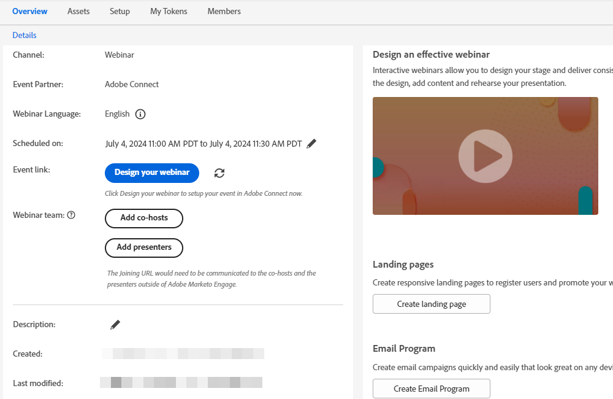

# Een interactief webinar maken {#create-an-interactive-webinar}

Maak een interactief webinar in een paar eenvoudige stappen.

1. Ga naar **Marketingactiviteiten**.

   

1. Klik met de rechtermuisknop op de gewenste map en selecteer **Nieuw programma**.

   

1. Geef het programma een naam. Selecteer onder Type programma de optie **Gebeurtenis**.

   

1. Klik op de vervolgkeuzelijst Kanaal en selecteer een kanaal met _Gebeurtenis met webinar_ in de kolom &quot;Toepassen op&quot;. In dit voorbeeld kiezen we **Webinar**.

   

   >[!NOTE]
   >
   >Controleren op welke kanalen van toepassing zijn _Gebeurtenis met webinar_, ga naar **Beheerder** > **Tags**. &quot;Van toepassing op&quot; moet de middelste kolom zijn. Meer informatie over &quot;van toepassing op&quot; in stap 5 van [dit artikel](/help/marketo/product-docs/administration/tags/create-a-program-channel.md){target="_blank"}.

1. Kies **Interactieve webinars** en klik op **Volgende**.

   

   >[!NOTE]
   >
   >Hier vindt u informatie over webinars van partners.

1. Stel de maximale doelgrootte voor uw webinar in en de duur ervan.

   

1. Plan de datum/tijd van uw webinar en klik **Maken**.

   

Uw interactief webinar wordt gecreeerd. U kunt nu een webinar team toevoegen.

## Webinar Team {#webinar-team}

Een webinar Team in Interactieve Webinars bestaat uit alle rollen die tot de succesvolle levering van webinar in Adobe Connect bijdragen. Dit geldt zowel voor presentatoren als voor co-hosts.

>[!NOTE]
>
>Presentatoren en cohosts in Marketo wijzen de rollen van presentator en cohost tijdens de webinar-levering in Adobe Connect exact toe.

De presentator is een externe rol die deelneemt aan het leveren van de webinar ervaring, terwijl co-hosts als presentator kunnen optreden en administratieve aspecten van webinar levering kunnen behandelen. Cohosts kunnen zowel intern als extern zijn. Externe co-hosts hebben geen toegang tot de interactieve Webinar-gebeurtenisprogramma&#39;s in Marketo, maar hebben machtigingen voor co-host tijdens levering in Adobe Connect. Interne cohosts hebben tijdens de levering toegang tot zowel het interactieve webinar-gebeurtenisprogramma in Marketo als tot machtigingen voor co-host. Dit helpt ervoor zorgen dat de interne co-hosts de rijen van het Interactive Webinar-gebeurtenisprogramma kunnen nemen wanneer de oorspronkelijke maker van het Interactive Webinar-programma geen deel meer uitmaakt van de gebruikersset van Interactive Webinars of zelfs geen Marketo-gebruiker is.

### Een webinar-team toevoegen {#adding-a-webinar-team}

Als u een cohost of presentator wilt toevoegen, klikt u op **Co-hosts toevoegen** of **Presentatoren toevoegen** op het scherm Overzicht.

Na klikken **Presentatoren toevoegen**, wordt u gevraagd hun voornaam, achternaam en e-mailadres in te voeren. Deze informatie wordt tijdens webinar-levering beschikbaar gesteld aan Adobe Connect, zodat de juiste gegevens automatisch kunnen worden ingevuld zonder dat de gebruiker ze tijdens de vermelding voor webinar-levering hoeft in te voeren. Een bij elkaar horende URL wordt gevuld voor alle presentatoren en kan door de maker worden gedeeld.

Na klikken **Co-hosts toevoegen**, wordt u gevraagd een interne of een externe gebruiker toe te voegen. Als u intern selecteert, kunt u de gewenste gebruiker van de lijst van alle gebruikers selecteren die als Interactieve Webinars gebruikers in Marketo Engage zijn toegevoegd. Als u een externe toepassing selecteert, wordt u gevraagd om de voornaam, achternaam en e-mailadres toe te voegen (vergelijkbaar met het toevoegen van een presentator). U kunt ook de toetredende URL&#39;s verkrijgen waarmee zowel interne als externe gebruikers kunnen worden gedeeld.

Nadat u een webinar team hebt toegevoegd, kunt u op het kopieerpictogram naast elke gebruiker klikken om de URL&#39;s die aan het team deelnemen te kopiëren (en deze vervolgens te delen).

 

Nu is het tijd om [webinar ontwerpen](/help/marketo/product-docs/demand-generation/events/interactive-webinars/designing-interactive-webinars.md){target="_blank"}.
