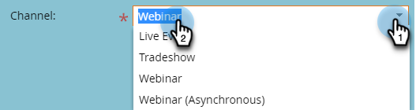
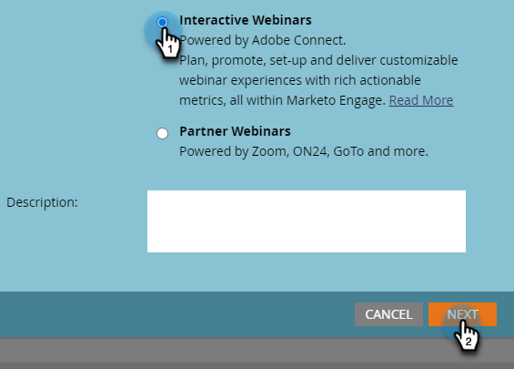

# Een interactief webinar maken {#create-an-interactive-webinar}

Maak een interactief webinar in een paar eenvoudige stappen.

1. Ga naar **de Marketing Activiteiten**.

   

1. Klik de gewenste omslag met de rechtermuisknop aan en selecteer **Nieuw Programma**.

   

   >[!CAUTION]
   >
   >](/help/marketo/product-docs/mobile-marketing/push-notifications/understanding-push-notifications.md){target="_blank"} de activa van het Bericht van de Duw van 0} Mobiele **worden** niet gesteund in Interactieve Webinars.[

1. Geef het programma een naam. Onder Type van Programma, uitgezochte **Gebeurtenis**.

   

1. Klik het drop-down Kanaal en selecteer om het even welk kanaal dat _Gebeurtenis met Webinar_ in zijn &quot;van toepassing is op&quot;kolom heeft. In dit voorbeeld, kiezen wij **Webinar**.

   

   >[!NOTE]
   >
   >Om te zien welke Kanalen op _Gebeurtenis met Webinar_ van toepassing zijn, ga **Admin** > **Markeringen**. &quot;Van toepassing op&quot; moet de middelste kolom zijn. Leer meer over &quot;van toepassing is op&quot;in Stap 5 van [ dit artikel ](/help/marketo/product-docs/administration/tags/create-a-program-channel.md){target="_blank"}.

1. Kies **Interactieve Webinars** en klik **daarna**.

   

1. Geef je webinar een titel. Stel de maximale doelgrootte in en de duur ervan.

   

   >[!NOTE]
   >
   >* De titel van het webinar is zichtbaar voor deelnemers wanneer ze zich aansluiten. Het is belangrijk dat de titel verschilt van de naam van het Interactive Webinars Event Program in uw Marketo Engage-instantie en van de naam van de webinar-ruimte.
   >
   >* U kunt een webinar-titel niet opnieuw gebruiken. Elke moet uniek zijn in je Marketo-exemplaar.
   >
   >* U kunt de webinar titel desgewenst in een later stadium wijzigen.
   >
   >* Als u een testwebinar creeert, moet het vóór zijn begintijd worden geschrapt om ervoor te zorgen dat de vergunning voor dat webinar niet wordt gebruikt.

1. Plan de datum/de tijd van uw webinar en klik **creëren**.

   

>[!NOTE]
>
>Het wordt aanbevolen twee opeenvolgende gebeurtenissen 30 minuten uit elkaar te houden (tenzij de licentie gelijktijdige webinars ondersteunt) als buffer voor het geval dat de vorige webinar langer dan de geplande tijd loopt.

Nu, is het tijd aan [ ontwerp uw webinar ](/help/marketo/product-docs/demand-generation/events/interactive-webinars/designing-interactive-webinars.md){target="_blank"}.

>[!IMPORTANT]
>
>Het wordt hoogst geadviseerd dat u uw webinar _ontwerpt alvorens_ presentatoren of medegastheren toe te voegen.

>[!MORELIKETHIS]
>
>[ Leer hoe te om presentatoren en/of medegastheren toe te voegen ](/help/marketo/product-docs/demand-generation/events/interactive-webinars/add-a-webinar-team.md){target="_blank"}
