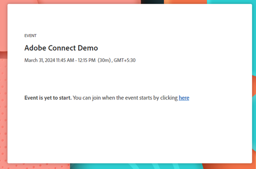

# Een interactief webinar leveren {#deliver-an-interactive-webinar}

Uw interactieve webinar is klaar om te gaan. Ontdek alles wat je nodig hebt om het te presenteren.

1. Selecteer uw gebeurtenis en klik **ga uw webinar** in.

   

   >[!NOTE]
   >
   >We raden u aan dit minstens 15 minuten voor de geplande starttijd te doen.

1. Als u een co-host of presentator bent, klikt u op de persoonlijke koppeling in de e-mail die u voor het webinar hebt ontvangen.

1. Selecteer uw audio/videovoorkeur en klik **binnengaan Ruimte**.

   

1. Selecteer de lay-out die aan vroege verbindingspunten moet worden getoond.

   

   >[!NOTE]
   >
   >Deelnemers kunnen de ruimte tot 15 minuten voor de geplande start betreden en zien de actieve lay-out. We raden je aan een &#39;Lobby&#39;-lay-out voor hen te ontwerpen.

   >[!TIP]
   >
   >Schakel besturingselementen voor uitzenden in om een virtuele groene ruimte te betreden. Zo kunnen gastheren en presentatoren privé spreken en elkaar zien zonder dat audio en video naar de deelnemers in de ruimte worden uitgezonden. Het is ideaal voor en na de sessie, waar u uw audio en video kunt testen, of een debrief na het webinar.

1. U kunt de sessie indien nodig opnemen. Selecteer **zitting van het Verslag** van het ruimtemenu. Opname kan later vanuit hetzelfde menu worden gestopt.

   

1. Uw sessie begint op het aangegeven tijdstip.

1. Klik op de naam van de ruimte. In drop-down, uitgezochte **Gastheer &amp; het gebied van de Presentator** aan praatje of aandeelnota&#39;s met het presentatieteam backstage. De host en het presentatorgebied worden aan de rechterkant van het scherm geopend. Alleen gastheren/co-hosts en presentatoren kunnen dit gedeelte van het scherm zien.

   

1. Wanneer de zitting volledig is, klik het rode pijlpictogram en selecteer **zitting van het Eind voor allen**.

   

   >[!CAUTION]
   >
   >Als u op de afsluitruimte klikt, verlaat u de ruimte alleen. Het zal **niet** webinar beëindigen.

   >[!TIP]
   >
   >Leer meer over [&#x200B; gebeurtenisprestaties en opnamen &#x200B;](/help/marketo/product-docs/demand-generation/events/interactive-webinars/event-workflows.md){target="_blank"}.

## Deelnemerervaring {#participant-experience}

Deelnemers kunnen deelnemen aan het webinar door op de gepersonaliseerde koppeling te klikken die ze hebben ontvangen nadat ze zich hebben geregistreerd voor de gebeurtenis.

1. Deelnemers die de koppeling naar de gebeurtenis meer dan 15 minuten voor de geplande start starten, zien een bestemmingspagina waarop ze moeten wachten totdat de gebeurtenis wordt gestart.

   

1. Deelnemers moeten hun audiovoorkeuren selecteren en vervolgens op Ruimte betreden klikken. Deelnemers die voor het eerst een Adobe Connect-ruimte betreden, zien ook een browserpop-up voor microfoonmachtiging. Adobe Connect heeft deze toegang nodig voor deelnemers om hun microfoon later in de ruimte te kunnen gebruiken.

   

   >[!NOTE]
   >
   >Het pop-upvenster met bevoegdheden kan worden gesloten zonder toegang te verlenen. Deelnemers moeten toegang verschaffen binnen de ruimte als ze hun microfoon willen inschakelen.

## Instellingen en gebieden {#settings-and-areas}

### Host en presentator {#host-and-presenter-area}

Het gebied &quot;Gastheer &amp; Presentator&quot; (ook wel &quot;Achtergrond&quot; genoemd) is een privégebied dat zich aan de rechterkant van een vergaderruimte bevindt en dat alleen gastheren en presentatoren kunnen zien. Deze kan worden gebruikt voor samenwerking vóór, tijdens en na een gebeurtenis. Chatten, notities en andere pods gebruiken als achtergrondkanalen in het gebied Host en Presenter.

Om toegang te hebben, selecteer **Gastheer &amp; het gebied van de Presentator** van het ruimte drop-down menu. Leer meer over dit gebied in [&#x200B; volgend video &#x200B;](https://www.youtube.com/watch?v=11GkcvIUttY){target="_blank"}.

### Besturingselementen voor uitzenden {#broadcast-controls}

De Controle van de uitzending voegt een virtuele groene ruimte aan uw Interactieve zitting Webinars toe. Gastheren en presentatoren kunnen dan spreken en elkaar persoonlijk zien zonder uit te zenden naar de deelnemers in de ruimte. Het is een geweldige manier om je microfoon en webcam te testen voor een sessie. Presentatoren kunnen ook samenwerken in het gebied Gastheer en Presentator totdat ze klaar zijn om live te gaan. Het biedt een manier voor de spreker en de producenten om na een sessie privé met elkaar te spreken, voor het geval een deelnemer het webinar vergeet te verlaten.

De Controles van de uitzending kunnen opstelling zijn beginnen automatisch registrerend nadat u de groene ruimte verlaat. Dit zorgt ervoor dat gastheren niet hoeven te onthouden om de opname handmatig te starten en te stoppen. Als u de uitzending onderbreekt of stopt, wordt de opname ook gepauzeerd of gestopt. Alles is automatisch.

Leer meer over de Controles van de Uitzending [&#x200B; in deze video &#x200B;](https://www.youtube.com/watch?v=TcoCeEJoyjg){target="_blank"}.

### Chatten in opnamen {#chats-in-recordings}

Afhankelijk van het gebruiksgeval, zou het een goed idee kunnen zijn om of binnen-kamerpraatje binnen de gebeurtenisopnamen te omvatten of uit te sluiten.

Discussies in de chatpods worden altijd opgenomen. Als de chatdiscussies dus waarde toevoegen aan de opname van viewers (deelnemers en de viewers op aanvraag de live gebeurtenis plaatsen), gebruikt u de chatpods bij het ontwerpen van de ruimte.

Discussie in het deelvenster Chat wordt niet opgenomen. Het deelvenster Chat maakt ook het onroerend goed vrij dat zou zijn bezet door chatpod in de lay-out. Dus als de chatdiscussies geen toegevoegde waarde zullen hebben voor het opnemen van viewers, gebruikt u het deelvenster Chat in plaats van chatpods bij het ontwerpen van de ruimte.

Leer meer over [&#x200B; het Comité van het Praatje &#x200B;](https://helpx.adobe.com/adobe-connect/using/notes-chat-q-a-polls.html#chat_panel){target="_blank"}.

### Voorbereidingsmodus {#prepare-mode}

Met de modus Voorbereiden kunnen gastheren en presentatoren achter de schermen een schermindeling van de vergaderruimte maken of wijzigen, terwijl een sessie plaatsvindt. De deelnemers zien de wijzigingen echter pas als de gastheer deze zichtbaar maakt. Met de functie Modus Voorbereiden worden de live pods in blauwe en niet-live pods in wit gemarkeerd.

De voorbereidingsmodus gebruiken:

1. Klik op het moersleutelpictogram onder aan het deelvenster Lay-outs.

   

1. Kies in het deelvenster Lay-outs de lay-out die u wilt aanpassen. U kunt pods naar wens verplaatsen, verbergen of weergeven. U kunt de inhoud in pods ook bijwerken, zoals een nieuwe versie van de presentatie uploaden in een pod Delen.

1. Wanneer de veranderingen worden gedaan, kies **Eind voorbereidt Wijze** van het drop-down menu, of klik het moersleutelpictogram een tweede keer.

Hiermee schakelt u de voorbereidingsmodus uit en keert u terug naar de actieve indeling.

Leer meer over Voorbereidende Wijze [&#x200B; in deze video &#x200B;](https://www.youtube.com/watch?v=kUya84sx-E4){target="_blank"}.

>[!NOTE]
>
>* Wijzigingen die worden aangebracht in de live pods worden direct weerspiegeld in de deelnemers.
>* [&#x200B; het Comité van het Praatje &#x200B;](https://helpx.adobe.com/adobe-connect/using/notes-chat-q-a-polls.html#chat_panel){target="_blank"} maakt geen deel uit van Voorbereidingswijze en om het even welke veranderingen in het zullen onmiddellijk aan de deelnemers nadenken.

### Toegankelijkheid {#accessibility}

Adobe streeft ernaar presentatoren en deelnemers met een handicap op te nemen door de toegankelijkheid van interactieve webinars te verbeteren. De software wordt voortdurend verbeterd om te voldoen aan de behoeften van alle soorten gebruikers en om te voldoen aan de wereldwijde standaarden, waaronder personen met een visuele, auditieve, mobiliteitsfunctie of andere handicap.

Leer over hoe Adobe Connect hulp voor [&#x200B; visuele, auditieve, en mobiliteitsbehoeften &#x200B;](https://helpx.adobe.com/adobe-connect/using/accessibility-features.html){target="_blank"} verleent.

### Ondertiteling {#closed-captions}

Ondertiteling is een tekstuele weergave van de audio in een Adobe Connect-ruimte en helpt deelnemers die doof of moeilijk te horen zijn, aan gebeurtenissen deel te nemen. U kunt ondertiteling van audio-inhoud in realtime integreren in gebeurtenissen en deze ondertitels presenteren in de weergave Ondertiteling.

Leer hoe te [&#x200B; om gesloten titels &#x200B;](https://helpx.adobe.com/adobe-connect/using/closed-captioning-html-client.html){target="_blank"} toe te laten.

### Levende gesimuleerde webinars {#simulated-live-webinars}

Vooraf opgenomen webinars presenteren alsof ze live zijn met de indeling Gesimuleerd actief webinar. Deelnemers kunnen op een gepland tijdstip deelnemen en de sessie in real-time beleven, dankzij interactieve functies zoals chatten, opiniepeilingen en vragen en antwoorden. Gesimuleerde actieve webinars combineren de betrouwbaarheid van opgenomen inhoud met de interactieve ervaring van een livegebeurtenis.

Leer meer over [&#x200B; Gesimuleerde Levende webinars &#x200B;](https://helpx.adobe.com/adobe-connect/using/webinar/overview-of-simulated-live-webinars.html){target="_blank"}.
