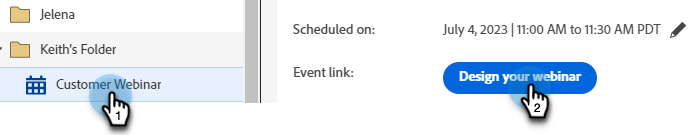
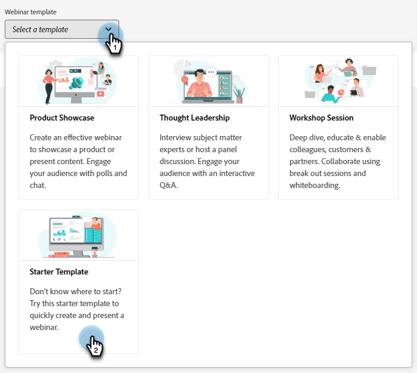

# Interactieve webinars ontwerpen {#designing-interactive-webinars}

Leer hoe u uw webinar ontwerpt om aan uw behoeften te voldoen.

1. Selecteer uw gebeurtenis en klik **Ontwerp Uw Webinar**.

   

1. U kunt een bestaande Webinar Zaal kiezen of nieuwe creëren. In dit voorbeeld creëren wij nieuwe, zodat klik de **Uitgezochte Ruimte** drop-down en kies **Nieuwe Interactieve Zaal Webinar**.

   

   >[!NOTE]
   >
   >* Een kamer is een online ruimte die wordt gebruikt om vergaderingen te houden.
   >
   >* Als u een bestaande Zaal Webinar kiest en het moet anders noemen, klik eenvoudig **anders noemen Zaal Webinar** knoop aan het recht.
   >
   >* In de vervolgkeuzelijst ziet u alleen bestaande ruimten die u eerder hebt gemaakt, niet andere hosts.

1. Kies een sjabloon.

   

1. Uw webinar voorproef zal verschijnen.

   

   >[!NOTE]
   >
   >Standaard is de naam van de ruimte in het veld &quot;Naam interactieve webinar ruimte&quot; dezelfde als die in het interactieve webinar-gebeurtenisprogramma. U kunt de naam wijzigen om de titel van het webinar zelf weer te geven, aangezien deze naam zichtbaar is voor uw publiek.

   >[!TIP]
   >
   >Uw webinar zal aan de standaardtaal in uw instantie van Marketo Engage worden geplaatst, maar u hebt de optie om talen per-webinar basis te veranderen door drop-down boven de voorproef te gebruiken.

1. U kunt verschillende lay-outs selecteren voor een voorvertoning. Om te werk te gaan, klik **Malplaatje van het Gebruik**.

   

1. U kunt uw webinar direct verfijnen, of later. Laten we het nu doen. Klik **verfijnen nu Uw Webinar**.

   

1. Selecteer uw audio/videovoorkeur en klik **binnengaan Ruimte**.

   

1. De geselecteerde sjabloon kan nu worden bewerkt.

   

1. Voor gedetailleerde informatie over ruimten en malplaatjes, controleer uit de &quot;malplaatjes en lay-outs van de vergaderingsruimte&quot;sectie van [ dit de hulpartikel van Adobe ](https://helpx.adobe.com/in/adobe-connect/using/creating-arranging-meetings.html#creating_and_arranging_meetings){target="_blank"}.

1. Wanneer u klaar bent met het ontwerpen van uw webinar, klik **Ruimte van de Uitgang**.

   

## Ontwerpelementen {#design-elements}

**Malplaatje**: Structuur die aan een ruimte wordt verstrekt op het doel van webinar wordt gebaseerd die wordt geleverd. Als u bijvoorbeeld een webinar voor de showcase van een product wilt plannen, is het delen van schermen een essentieel onderdeel van de demo. De sjabloon zorgt ervoor dat de essentiële componenten die vereist zijn voor een effectieve levering van een bepaald type webinar aanwezig zijn tijdens de configuratie van de webinarruimte.

**Lay-out**: Verwijs naar diverse manieren dat de veelvoudige componenten die worden vereist om het succes van webinar te verzekeren in een bepaald malplaatje worden geschikt. Eén sjabloon kan meerdere lay-outs bevatten waaruit u kunt kiezen. De essentiële componenten van het webinar zouden voor alle sjablonen hetzelfde blijven. De rangschikking die u hebt geselecteerd, is het meest geschikt voor de stijl/behoeften van u of de presentator die het webinar levert.

**Pod**: Een component binnen een malplaatje dat een bepaalde activiteit tijdens webinar uitvoert. Stel bijvoorbeeld een opiniepeiling in en lever een opiniepeiling om de reacties van deelnemers vast te leggen in één activiteit die kan worden uitgevoerd door een opiniepeilingpod. Op dezelfde manier kan het chatten met de deelnemers om een bericht over te brengen of tijdelijk met hen te communiceren een activiteit zijn die via de chatpod wordt geleverd. Er zijn meerdere andere pods beschikbaar, zoals Delen, Notities, Video, Chat, Deelnemerlijst, Bestanden, Webkoppelingen, Opiniepeilingen en Vragen en antwoorden.

>[!MORELIKETHIS]
>
>[ Leer hoe te om presentatoren en/of medegastheren toe te voegen ](/help/marketo/product-docs/demand-generation/events/interactive-webinars/add-a-webinar-team.md){target="_blank"}
