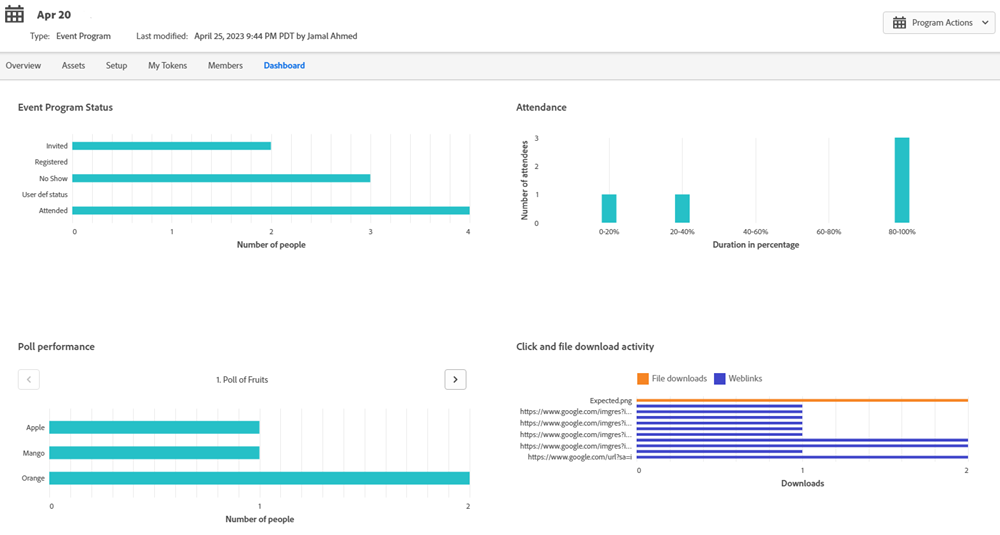

# Workflows voor gebeurtenissen {#event-workflows}

Nadat uw webinar wordt voltooid, ga naar het lusje van het Dashboard om de bijeengevoegde prestaties te zien.

>[!NOTE]
>
>Als het webinar niet is voltooid of de gegevens om welke reden dan ook niet zijn ontvangen, is het tabblad Dashboard nog niet beschikbaar.

## Dashboardwidgets {#dashboard-widgets}

Het dashboard bestaat uit vier widgets.

**Status van gebeurtenisprogramma**: Geeft de verschillende statussen van het programma voor die gebeurtenis weer en het aantal leden van het programma dat momenteel de waarde voor de status van dat programma heeft.

**Aanwezigheid** Betreft: De aanwezigheidsduur van verschillende leden die het webinar hebben bijgewoond, wordt uitgedrukt als percentage van de totale webinar-duur.

**Opiniepeilingprestaties**: Hiermee geeft u verschillende opiniepeilingen weer die zijn gestart tijdens het webinar van Adobe Connect en de verdeling van de leden die de opiniepeiling hebben bijgewoond en erop hebben gereageerd.

**Klikken en downloaden van bestanden**: Hiermee wordt het downloadaantal weergegeven van bestanden en webkoppelingen die tijdens het webinar van Adobe Connect zijn ingeschakeld door verschillende leden die het webinar hebben bijgewoond en die specifieke actie hebben uitgevoerd.

## Webinar-opname {#webinar-recording}

Ga naar het tabblad Overzicht om de opgenomen webinar weer te geven, krijg de koppeling om deze te delen, en download zelfs een kopie.

>[!NOTE]
>
>* Interactieve webinars worden niet automatisch opgenomen. Nadat uw webinar begint, klik drop-down naast de naam van webinar en selecteer **Recordsessie**.
>* De opname wordt gedownload in de MP4-indeling.
>* Wanneer het delen van de opname zal het door iedereen kunnen bekijken die de verbinding heeft, zodat wordt het gedeeld met het voorgenomen publiek.

## Triggers en filters {#triggers-and-filters}

Gebruik interactieve webinar-gerelateerde triggers en filters om specifieke groepen personen binnen uw gebeurtenisprogramma te zoeken.

Elke trigger/filter wordt geleverd met extra beperkingen, zodat u een subset met focus van die groep kunt vastleggen.

**Vragen tijdens gebeurtenis** (Filterversie: Heeft vragen gesteld tijdens de gebeurtenis)

**Gebeurtenis bijwonen** (Filterversie: heeft gebeurtenis bijgewoond)

**Klik op een koppeling** (Filterversie: op een koppeling klikken)

**Middelen downloaden** (Filterversie: Een element gedownload)

**Reageert op een opiniepeiling** (Filterversie: Op een opiniepeiling gereageerd)

