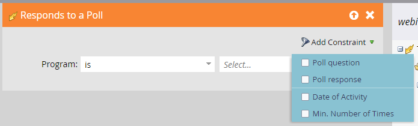

# Workflows voor gebeurtenissen {#event-workflows}

Nadat uw webinar wordt voltooid, ga naar het lusje van het Dashboard om de bijeengevoegde prestaties te zien.

>[!NOTE]
>
>Als het webinar niet is voltooid of de gegevens om welke reden dan ook niet zijn ontvangen, is het tabblad Dashboard nog niet beschikbaar.

## Handmatige synchronisatie {#manual-sync}

Met interactieve webinars kunt u de betrokkenheidsgegevens van uw webinar verkrijgen van Adobe Connect als u deze niet automatisch binnen twee uur na voltooiing van het webinar hebt ontvangen. 31 dagen na de Interactieve leveringsdatum van Webinar, verschijnt een &quot;Synchronisatie op bestelling de opties van de Activiteit&quot;op de rechterkant van de kopbal het _dashboard van webinar_. Als u erop klikt, wordt er een trekkracht uit Adobe Connect geactiveerd om de gegevens in Marketo Engage te vullen. Het synchroniseert gegevens van de datum van uw webinar tot de datum u **Synchronisatie op bestelling Activiteit** klikt.

## Dashboardwidgets {#dashboard-widgets}

Het dashboard bestaat uit vier widgets.

**Status van het Programma van de Gebeurtenis**: Toont de diverse programmastatussen voor die gebeurtenis en het aantal leden van het programma die momenteel die waarde van de programmastatus houden.

**Aanwezigheid**: benadrukt de aanwezigheidsduur van diverse leden die webinar in vergelijking met de algemene webinar duur in termen van percentage hebben bijgewoond.

**Prestaties van de Opiniepeiling**: Vertoningen diverse opiniepeilingen die tijdens webinar door Adobe Connect en de distributie van de leden worden gelanceerd die aan de opiniepeiling over elk van de antwoorden hebben bijgewoond en gereageerd.

**klik en de Activiteit van de Download van het Dossier**: Verstrekt de downloadtelling van dossier en weblinks klikte tijdens webinar aangedreven door Adobe Connect door diverse leden die webinar hebben bijgewoond en die specifieke actie genomen.

## Webinar-opname {#webinar-recording}

Ga naar het tabblad Overzicht om de opgenomen webinar weer te geven, krijg de koppeling om deze te delen, en download zelfs een kopie.

>[!NOTE]
>
>* Interactieve webinars worden niet automatisch opgenomen. Nadat uw webinar begint, klik drop-down naast de naam van webinar en selecteer **Zitting van het Verslag**.
>* Als de sessie wordt opgenomen, moet de gastheer de opname handmatig beëindigen of &quot;Eindsessie voor iedereen&quot; selecteren om de opname te stoppen. Anders wordt de opname automatisch gestopt binnen 10 minuten nadat de laatste deelnemer de ruimte heeft verlaten.
>* De opname wordt gedownload in de MP4-indeling.
>* Wanneer het delen van de opname zal het door iedereen kunnen bekijken die de verbinding heeft, zodat wordt het gedeeld met het voorgenomen publiek.

## Triggers en filters {#triggers-and-filters}

Gebruik interactieve webinar-gerelateerde triggers en filters om specifieke groepen personen binnen uw gebeurtenisprogramma te zoeken.

Elke trigger/filter wordt geleverd met extra beperkingen, zodat u een subset met focus van die groep kunt vastleggen.

**vraagt vragen tijdens gebeurtenis** (de versie van de Filter: Heeft vragen tijdens gebeurtenis gesteld)

**voegt gebeurtenis** bij (de versie van de Filter: heeft gebeurtenis bijgewoond)

**klikt op een verbinding** (de versie van de Filter: Geklikt op een verbinding)

**downloadt activa** (de versie van de Filter: Gedownload een activa)

**antwoordt aan een opiniepeiling** (de versie van de Filter: Responded aan een opiniepeiling)

