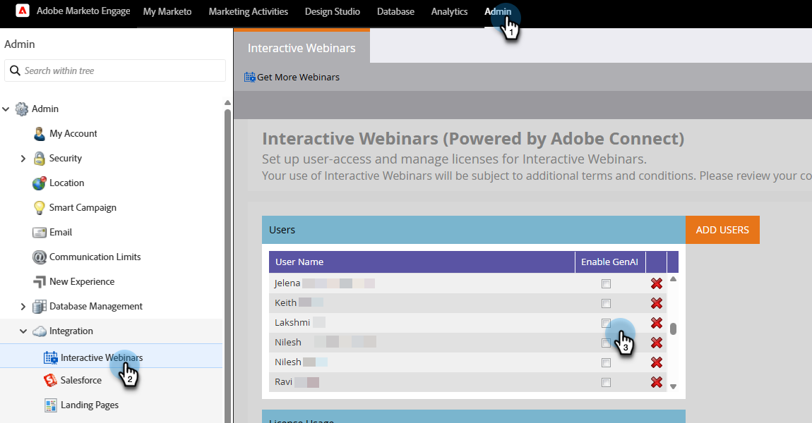

# GenAI-functies {#gen-ai-features}

Produceer automatisch hoofdstukken en samenvattingen voor uw geregistreerde webinars, die hen toegankelijker en gemakkelijker maken om voor uw publiek te navigeren.

* **Automatische Generatie van het Hoofdstuk**: De AI-Gerichte technologie leidt hoofdstukken voor uw webinar inhoud.

* **AI-Gegenereerde Samenvatting**: Krijg een geautomatiseerde tekstsamenvatting van uw webinar.

* **Bewerkbare Inhoud**: wijzig geproduceerde hoofdstukken en samenvattingen indien gewenst, gebruikend hand en op AI-Gebaseerde het uitgeven functionaliteiten.

* **Gemakkelijke Integratie**: Voeg gemakkelijk hoofdstukken en samenvattingen aan uw het Bestaan Pagina&#39;s toe door de code van HTML aan de webpage redacteur van uw keus te kopiëren.

## GenAI inschakelen {#enable-genai}

>[!PREREQUISITES]
>
>Voordat u deze functies kunt gebruiken, moet u eerst de Adobe GenAI-voorwaarden accepteren. Als u dit nog niet hebt gedaan, kunt u het Adobe-accountteam (uw accountmanager) raadplegen voor meer informatie.

Nadat u de Adobe GenAI-voorwaarden hebt geaccepteerd, kunt u deze nu inschakelen voor individuele gebruikers. Ga hiervoor naar **[!UICONTROL Admin]** > **[!UICONTROL Interactive Webinars]** en selecteer welke gebruikers toegang moeten hebben tot GenAI.

{width="800" zoomable="yes"}

## Toegang krijgen {#how-to-access}

1. Navigeer naar de overzichtspagina van het webinar in Marketo Engage Interactive Webinars.

1. Nadat u uw webinar op aanvraag hebt uitgevoerd, wacht u 30 tot 60 minuten tot de AI de opname heeft verwerkt. De Generate knoop zal klikbaar worden wanneer het beschikbaar is.

1. Klik op **[!UICONTROL Generate]**.

   {width="800" zoomable="yes"}

1. Er wordt een nieuw tabblad geopend met door AI gegenereerde hoofdstukken en een tekstoverzicht.

## Gegenereerde inhoud bewerken {#edit-generated-content}

1. Controleer de gegenereerde hoofdstukken en het overzicht.

1. Klik op de knop **[!UICONTROL Edit]** als u wijzigingen wilt aanbrengen.

   Wijzigingen aanbrengen:

   * Bewerk de tekst in het overzicht en/of de titels van het hoofdstuk.

   * Pas indien nodig tijdstempels aan door de waarden in tijdstempelvelden te bewerken.

   * Verwijder ongewenste hoofdstukken door deze te selecteren en op **[!UICONTROL Delete]** te klikken.

   * U kunt twee opeenvolgende hoofdstukken samenvoegen door deze te selecteren en op **[!UICONTROL Merge]** te klikken.

      * AI genereert een samengesteld hoofdstuk dat bestaat uit de twee geselecteerde hoofdstukken

      * Als u meerdere hoofdstukken wilt samenvoegen, moet u twee voor één doen

     {width="800" zoomable="yes"}

   >[!NOTE]
   >
   >* Indien gewenst, kunt u de kwaliteit van de geproduceerde hoofdstukken/samenvatting met _duim-omhoog_  of _duimen-onderaan_  pictogrammen schatten. U kunt om het even welke problematische inhoud ook markeren door het vlagpictogram  te klikken.
   >
   >* Als u niet tevreden bent met het eerste overzicht, kunt u op de knop **[!UICONTROL Regenerate summary]** klikken en wordt een andere versie gegenereerd.

1. Sla de wijzigingen op door op de knop **[!UICONTROL Save]** rechtsboven in het scherm te klikken.

## Gegenereerde inhoud gebruiken {#use-generated-content}

Nadat u de gewenste inhoud hebt gekopieerd, plakt u deze in de gewenste editor (bijvoorbeeld de Marketo Engage Landing Page Editor) en brengt u de gewenste wijzigingen aan.

### Samenvatting {#summary}

**HTML van het Exemplaar** - klik de **[!UICONTROL Copy HTML]** knoop om alle tekst te krijgen, volledig met code die van HTML het binnen van een lijst formatteren.

**Tekst slechts** - als u de tekst slechts wilt, benadruk het en selecteer Cmd+C (of klik met de rechtermuisknop) om te kopiëren.

### Hoofdstukken {#chapters}

**HTML van het Exemplaar** - klik de **[!UICONTROL Copy HTML]** knoop om alle opname en zijn hoofdstukken te krijgen die binnen van een videospeler worden geformatteerd.

## Uw doelgroep

Gebruik filters en/of triggers voor slimme campagnes/lijsten om te zien wat elke viewer heeft bekeken, hoe vaak, enz., zodat u gepersonaliseerde follow-ups kunt maken.

{width="800" zoomable="yes"}

* **Triggers**: _klikt Verbinding op Web-pagina_, _Bezoekt Web-pagina_

* **Filters**: _Geklikte Verbinding op Web-pagina_, _Bezochte Web-pagina_

De &quot;verbinding&quot;is de naam van het hoofdstuk, en de &quot;Web-pagina&quot;is de pagina die uw Op bestelling webinar ontvangt.

>[!TIP]
>
>Gebruik [ beperkingen ](/help/marketo/product-docs/core-marketo-concepts/smart-lists-and-static-lists/using-smart-lists/add-a-constraint-to-a-smart-list-filter.md){target="_blank"} om uw doelpubliek verder te verfijnen.

## Notities {#things-to-note}

* Het verwijderen of samenvoegen van hoofdstukken heeft alleen invloed op de hoofdstukstapel, niet op de video-inhoud zelf. Deze acties zijn permanent.

* De GenAI-functies zijn flexibel en kunnen worden gebruikt met verschillende webpagina-editors, niet alleen met de editors in Marketo Engage.

* Bekijk altijd een voorvertoning van de wijzigingen voor de gewenste functionaliteit en vormgeving.

* Als u het webinar verwijdert, wordt ook de GenAI-inhoud verwijderd.

* Als u de GenAI-inhoud wilt verwijderen zonder het webinar te verwijderen, neemt u contact op met het Adobe-accountteam (uw accountmanager) of stuurt u een aanvraag voor het verwijderen van gegevens naar: `marketo-webinar-genai-alerts@adobe.com` .
