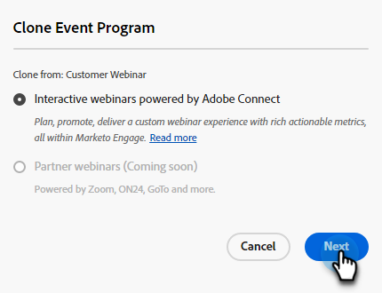

# Een interactief webinar wijzigen of verwijderen {#modify-or-delete-an-interactive-webinar}

Leer hoe te om veranderingen in uw Interactief Webinar aan te brengen.

## Een interactief webinar wijzigen {#modify-an-interactive-webinar}

1. Selecteer het gewenste gebeurtenisprogramma en klik op **Ruimte/sjabloon wijzigen**.

   

1. Tekst

PICC

??? voor Nilesh - is het normaal om niet naar de kamer te worden gebracht waar Webinar al in zit? Zo nee, wat is de beste praktijk?

## Een interactief webinar opnieuw plannen {#reschedule-an-interactive-webinar}

1. Selecteer het gewenste gebeurtenisprogramma en klik op het potloodpictogram naast de geplande datum/tijd.

   

1. Klik op het kalenderpictogram, kies de nieuwe datum/tijd en klik op **Opslaan**.

   

## Een interactief webinar klonen {#clone-an-interactive-webinar}

1. Selecteer het gewenste gebeurtenisprogramma.

   

1. Klik op de vervolgkeuzelijst Programmaacties en selecteer **Klonen**.

   

   >[!TIP]
   >
   >U kunt ook met de rechtermuisknop op het gebeurtenisprogramma in de boomstructuur klikken en **Klonen** vanaf daar.

1. Geef het gekloonde programma een naam, stel de werkruimte en het doel in (als u het programma ergens anders wilt laten wonen) en klik op **Opslaan**.

   

1. Klikken **Volgende**.

   

1. Kies de instellingen voor uw gekloonde webinar en klik op **Klonen**.

   

## Een interactief webinar verwijderen {#delete-an-interactive-webinar}

1. Selecteer het gewenste gebeurtenisprogramma.

   

1. Klik op de vervolgkeuzelijst Programmaacties en selecteer **Verwijderen**.

   

   >[!TIP]
   >
   >U kunt ook met de rechtermuisknop op het gebeurtenisprogramma in de boomstructuur klikken en **Verwijderen** vanaf daar.

1. Klikken **Verwijderen**.

   

   >[!IMPORTANT]
   >
   >Als het programma lokale middelen bevat, worden deze ook verwijderd.
