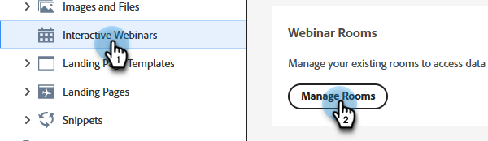

# Ruimtebeheer {#room-management}

Interactieve webinarruimten die door Adobe Connect worden aangedreven, zijn ontworpen om aantrekkelijke en gezamenlijke online evenementen mogelijk te maken. In deze webinars worden inhoud en opnamen opgeslagen die tijdens het webinar zijn gemaakt en gebruikt. Als lid met het recht om een ruimte tot stand te brengen, kunt u tot hen van een centrale plaats toegang hebben en leiden.

>[!NOTE]
>
>U hebt alleen toegang tot de ruimten die u voor een webinar hebt gemaakt en niet tot ruimten van andere leden in uw organisatie.

## Ruimten en opnamen beheren en openen {#manage-and-access-rooms-and-recordings}

1. Ga naar de **[!UICONTROL Design Studio]** .

   

1. Selecteer **[!UICONTROL Interactive Webinars]** en vervolgens **[!UICONTROL Manage Rooms]** .

   

### Ruimten {#rooms}

Een interactieve webinarruimte is een virtuele ruimte die is ontworpen voor het hosten van live, boeiende, online gebeurtenissen waar deelnemers kunnen communiceren met de presentator en andere deelnemers. In deze ruimten kunt u de geüploade inhoud en opnamen vinden via webinars.

Als u de lijst met al uw ruimten wilt weergeven, selecteert u **[!UICONTROL Rooms]** in de bovenste menubalk. U kunt in deze ruimten alle ruimten zoeken die u samen met geüploade inhoud en opnamen hebt gemaakt. U kunt ook het aantal opnamen, de bestandsgrootte in de ruimte en de datum bekijken die het laatst is geopend voor de desbetreffende ruimten.

<table><tbody>
  <tr>
    <td><b>Opnamen</td>
    <td>Het aantal opnamen weergeven dat beschikbaar is in een ruimte.</td>
  </tr>
  <tr>
    <td><b>Bestandsgrootte in de ruimte</td>
    <td>De gecombineerde bestandsgrootte weergeven van inhoud en opnamen die beschikbaar zijn in een ruimte.</td>
  </tr>
  <tr>
    <td><b>Laatst geopend op</td>
    <td>Geeft de datum weer waarop de ruimte voor het laatst is geopend. U kunt de gegevens sorteren op basis van de tijdlijn.</td>
  </tr>
</tbody>
</table>

U kunt de volgende acties vanuit deze gecentraliseerde interface uitvoeren:

* Klik op het pictogram Opstartruimte om de ruimte te starten en binnen te gaan.
* Gebruik de zoekbalk om de ruimte te zoeken die u zoekt (u kunt alleen zoeken in de ruimten die u hebt gemaakt).
* Klik op het pictogram Ruimte verwijderen om de ruimte te verwijderen. Hiermee verwijdert u alle opnamen en bestanden die betrekking hebben op de ruimte.

Wanneer u een ruimte selecteert, kunt u de inhoud of opnamen weergeven die beschikbaar zijn in die ruimte. Op dit scherm, is de informatie beschikbaar binnen twee lusjes: het **lusje van de Inhoud** {en **Opnamen** tabel.

**Inhoud tabel**

Op het tabblad Inhoud kunt u de geüploade bestanden bekijken, evenals het type, de grootte, de datum waarop het laatst is geopend en de datum waarop het bestand is geüpload.

<table><tbody>
  <tr>
    <td><b>Type</td>
    <td>Hier ziet u het bestandstype PDF, JPG, PNG, enzovoort.</td>
  </tr>
  <tr>
    <td><b>Grootte</td>
    <td>De grootte van het beschikbare bestand weergeven.</td>
  </tr>
  <tr>
    <td><b>Laatst geopend op</td>
    <td>Geeft de datum weer waarop de ruimte voor het laatst is geopend. U kunt de gegevens sorteren op basis van de tijdlijn.</td>
  </tr>
  <tr>
    <td><b>Geüpload</td>
    <td>Hiermee kunt u zien wanneer het bestand is geüpload.</td>
  </tr>
</tbody>
</table>

U kunt de volgende handelingen uitvoeren op het tabblad Inhoud:

* Klik op de knop **[!UICONTROL Launch room]** om de ruimte te starten en te betreden.
* Gebruik de zoekbalk om het gewenste bestand te zoeken.
* Klik op het pictogram Bestanden downloaden om een bestand op uw apparaat te downloaden. Selecteer twee of meer bestanden die u bulksgewijs wilt downloaden.
* Klik op het pictogram Ruimte verwijderen om de ruimte te verwijderen. Wanneer een bestand wordt verwijderd, kan het niet worden opgehaald.
* Selecteer een bestand in de lijst om het op het apparaat weer te geven.

**Opnamen tabel**

Op het tabblad Opnamen kunt u alle opnamen weergeven die in deze ruimte beschikbaar zijn. Elke opname wordt weergegeven met details zoals grootte, datum en tijd van opname en duur.

U kunt de volgende acties van deze gecentraliseerde hub uitvoeren:

* Klik op de knop **[!UICONTROL Launch room]** om de ruimte te starten en te betreden.
* Gebruik de zoekbalk om de opname te zoeken die u zoekt.
* Klik op het pictogram Bestanden downloaden om een bestand op uw apparaat te downloaden. Selecteer twee of meer bestanden die u bulksgewijs wilt downloaden.
* Klik op het pictogram Koppeling voor opname kopiëren om de opname-URL te kopiëren.
* Klik op het pictogram Opname bewerken om de opname te wijzigen.
* Klik op het pictogram Verwijderen om de opname te verwijderen. Wanneer een opname wordt verwijderd, kan deze niet worden opgehaald.
* Selecteer een opname om deze af te spelen op het apparaat.

## Opnamen beheren en openen {#manage-and-access-recordings}

Opnamen zijn waardevolle bronnen, waarin de essentie van live discussies, presentaties en vragen en antwoorden wordt vastgelegd. Ze stellen deelnemers in staat om belangrijke inzichten, gemiste details of complexe concepten in hun eigen tempo te herzien.

Klik op het tabblad **[!UICONTROL Recordings]** om een lijst weer te geven met alle opnamen die u hebt geüpload.

Onder **[!UICONTROL My recordings]** vindt u alle opnamen die beschikbaar zijn in de ruimte die u hebt gemaakt. U kunt ook hun respectievelijke grootte, datum en tijd en duur van opnamen weergeven.

U kunt de volgende acties van deze gecentraliseerde hub uitvoeren:

* Gebruik de zoekbalk om de opname te zoeken die u zoekt. U kunt ook in een tijdlijn zoeken door een datumbereik te selecteren.
* Klik op het pictogram Koppeling voor opname kopiëren om de opname-URL te kopiëren.
* Klik op het pictogram Opname bewerken om de opname te wijzigen.
* Klik op het pictogram Gekoppelde pagina weergeven om de informatie weer te geven over de ruimte waar de geselecteerde opname beschikbaar is.
* Klik op het pictogram Verwijderen om de opname te verwijderen. Wanneer een opname wordt verwijderd, kan deze niet worden opgehaald.
* Selecteer een opname om deze af te spelen op het apparaat.
