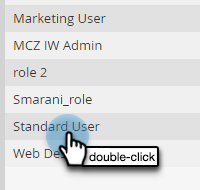

# Sjablonen voor interactieve webinars {#templates-for-interactive-webinars}

Maak eenvoudig te gebruiken sjablonen in interactieve webinars om inhoud sneller te produceren en in overeenstemming te blijven met de richtlijnen van het merk wanneer u aan een team werkt.

## Een sjabloon maken {#create-a-template}

1. Klik in Marketo Engage op **[!UICONTROL Design Studio]**.

   

1. Klik op **[!UICONTROL Interactive Webinars]**.

   

1. Klik op **[!UICONTROL Manage Templates]**.

   

1. Er wordt een nieuw tabblad geopend. Klikken **Nieuw maken**.

   

1. Selecteer de gewenste sjabloon op het tabblad Standaardsjablonen en klik op **Volgende**.

   

   >[!NOTE]
   >
   >Organisatiesjablonen zijn de sjablonen die u of uw team al hebt gemaakt.

1. Voer een naam en beschrijving in. Klikken **Opslaan en openen**.

   

1. Er wordt een nieuw tabblad geopend. Als u de sjabloon wilt bewerken/opslaan, moet u een ruimte betreden. Aangezien dit geen echte webinarruimte is, hoeft u geen audio- of videoselecties te maken. Klikken **Ruimte betreden**.

   

1. Breng de gewenste wijzigingen aan in de bestaande sjabloon.

   

1. Selecteer in het menu Afsluiten rechtsboven de optie **Sessie beëindigen voor iedereen**.

   

1. Klikken **Nu beëindigen**.

   

Uw sjabloon wordt automatisch opgeslagen.

## Een sjabloon bewerken {#edit-a-template}

Voer de onderstaande stappen uit om een bestaande sjabloon te bewerken.

1. Klik in Marketo Engage op **[!UICONTROL Design Studio]**.

   

1. Klik op **[!UICONTROL Interactive Webinars]**.

   

1. Klik op **[!UICONTROL Manage Templates]**.

   

1. Er wordt een nieuw tabblad geopend. Zoek de sjabloon die u wilt bewerken en klik op het pictogram Openen.

   

1. Er wordt een nieuw tabblad geopend. Als je je template wilt bewerken, moet je een ruimte betreden. Aangezien dit geen echte webinarruimte is, hoeft u geen audio- of videoselecties te maken. Klikken **Ruimte betreden**.

   

1. Breng de gewenste wijzigingen aan in de sjabloon.

   

1. Selecteer in het menu Afsluiten rechtsboven de optie **Sessie beëindigen voor iedereen**.

   

1. Klikken **Nu beëindigen**.

   

Uw wijzigingen worden automatisch opgeslagen.
