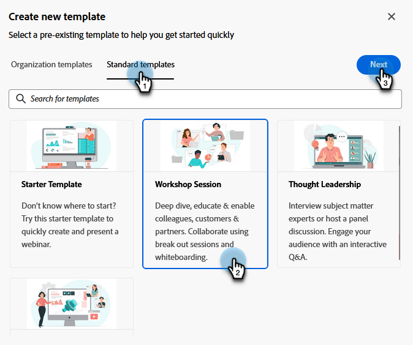
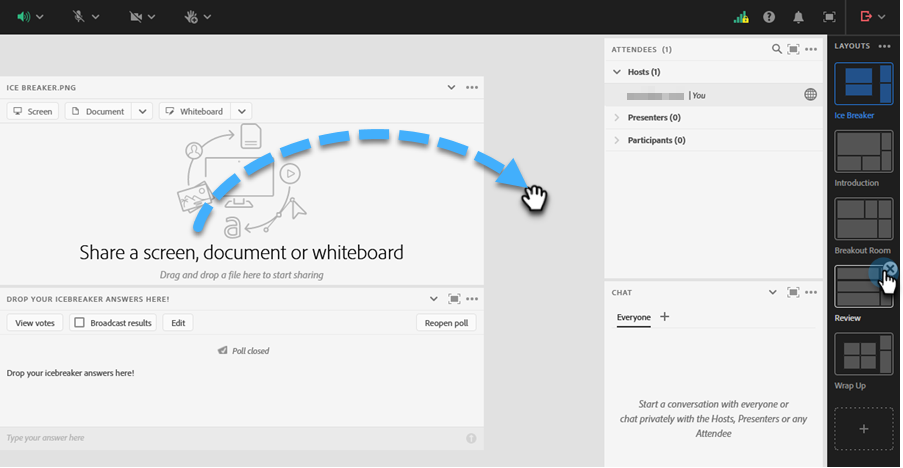

# Sjablonen voor interactieve webinars {#templates-for-interactive-webinars}

Maak eenvoudig te gebruiken sjablonen in interactieve webinars om inhoud sneller te produceren en in overeenstemming te blijven met de richtlijnen van het merk wanneer u aan een team werkt.

## Rechten verlenen {#grant-permissions}

Alvorens om het even welke gebruikers in uw organisatie de capaciteit hebben om tot malplaatjes toegang te hebben uw Interactieve Webinars, moet een beheerder van het Marketo Engage eerst toegang tot de gewenste rol(s) toevoegen.

1. Klik in Marketo Engage op **[!UICONTROL Admin]** .

   

1. Klik op **[!UICONTROL Users & Roles]** en vervolgens op de tab **[!UICONTROL Roles]** .

   

1. Dubbelklik op de rol waaraan u de machtigingen wilt toevoegen.

   

1. Klik om **[!UICONTROL Access Design Studio]** te openen.

   

1. Schakel het selectievakje **[!UICONTROL Access Interactive Webinars Templates]** in.

   

## Een sjabloon maken {#create-a-template}

1. Klik in Marketo Engage op **[!UICONTROL Design Studio]** .

   

1. Klik op **[!UICONTROL Interactive Webinars]**.

   

1. Klik op **[!UICONTROL Manage Templates]**.

   

1. Er wordt een nieuw tabblad geopend. Klik **creëren Nieuw**.

   

1. In het Standaardmalplaatjes lusje, selecteer het gewenste malplaatje en klik **daarna**.

   

   >[!NOTE]
   >
   >Organisatiesjablonen zijn de sjablonen die u of uw team al hebt gemaakt.

1. Voer een naam en beschrijving in. Klik **sparen en open**.

   

1. Er wordt een nieuw tabblad geopend. Als u de sjabloon wilt bewerken/opslaan, moet u een ruimte betreden. Aangezien dit geen echte webinarruimte is, hoeft u geen audio- of videoselecties te maken. Klik **binnengaan Ruimte**.

   

1. Breng de gewenste wijzigingen aan in de bestaande sjabloon.

   

1. In het menu van de Uitgang bovenop recht, uitgezochte **zitting van het Eind voor allen**.

   

1. Klik nu **Eind**.

   

Uw sjabloon wordt automatisch opgeslagen.

## Een sjabloon bewerken {#edit-a-template}

Voer de onderstaande stappen uit om een bestaande sjabloon te bewerken.

1. Klik in Marketo Engage op **[!UICONTROL Design Studio]** .

   

1. Klik op **[!UICONTROL Interactive Webinars]**.

   

1. Klik op **[!UICONTROL Manage Templates]**.

   

1. Er wordt een nieuw tabblad geopend. Zoek de sjabloon die u wilt bewerken en klik op het pictogram Openen.

   

1. Er wordt een nieuw tabblad geopend. Als je je template wilt bewerken, moet je een ruimte betreden. Aangezien dit geen echte webinarruimte is, hoeft u geen audio- of videoselecties te maken. Klik **binnengaan Ruimte**.

   

1. Breng de gewenste wijzigingen aan in de sjabloon.

   

1. In het menu van de Uitgang bovenop recht, uitgezochte **zitting van het Eind voor allen**.

   

1. Klik nu **Eind**.

   

Uw wijzigingen worden automatisch opgeslagen.
