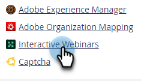

# Gebruiker- en licentiebeheer {#user-and-license-management}

Leer om gebruikers toe te voegen en te verwijderen en uw huidige vergunningen te bekijken.

## Een gebruiker toevoegen {#add-a-user}

1. Ga naar het **Admin** gebied.

   

1. Klik **Interactieve Webinars**.

   

1. Klik **toevoegen/verwijderen Gebruikers**.

   

1. Klik Beschikbare gebruikers drop-down, selecteer de gebruiker(s) u wenst om toe te voegen, en klik **O.K.**.

   

## Een gebruiker verwijderen {#remove-a-user}

1. Ga naar het **Admin** gebied.

   

1. Klik **Interactieve Webinars**.

   

1. Klik **toevoegen/verwijderen Gebruikers**.

   

1. Markeer de gebruiker(s) die u wilt verwijderen en druk op de toets Delete op het toetsenbord. Klik **O.K.** wanneer gedaan.

   

## Licentiegebruik {#license-usage}

Interactive Webinars biedt specifieke licenties voor het maken van gebeurtenissen die worden aangedreven door Adobe Connect. Telkens wanneer een licentie wordt toegevoegd, wordt er een nieuw gebruiksvak voor de licentie weergegeven. Marketo Admins kan de licenties weergeven (niet bewerken) door de onderstaande stappen uit te voeren. Neem contact op met het Adobe-accountteam (uw accountmanager) voor extra licenties.

1. Ga naar het **Admin** gebied.

   

1. Klik **Interactieve Webinars**.

   

1. Blader omlaag naar de Gebruikskaart(en) voor licenties.

   

<table>
  <tr>
   <td width="20%"><b>Begindatum</b></td>
   <td width="80%">De datum waarop de licentie begint.</td>
  </tr>
  <tr>
   <td width="20%"><b>Vervaldatum</b></td>
   <td width="80%">De vervaldatum van de licentie.</td>
  </tr>
  <tr>
   <td width="20%"><b>Type</b></td>
   <td width="80%">Het type licentie dat is aangeschaft. Er zijn drie typen beschikbaar: licentie voor gedeelde gebeurtenissen, licentie voor gedeelde ruimten, extra opslaglicentie.</td>
  </tr>
  <tr>
   <td width="20%"><b>Gebeurteniscapaciteit</b></td>
   <td width="80%">Het maximumaantal deelnemers dat in een gebeurtenis kan worden opgenomen.</td>
  </tr>
  <tr>
   <td width="20%"><b>Totaal aantal gebeurtenissen</b></td>
   <td width="80%">Het totale aantal gebeurtenissen dat is voorzien van deze licentie.</td>
  </tr>
  <tr>
   <td width="20%"><b>Verbruikte gebeurtenissen</b></td>
   <td width="80%">Alle voltooide en momenteel geplande gebeurtenissen. <a href="#things-to-note"> leer meer </a></td>
  </tr>
  <tr>
   <td width="20%"><b>Opslagcapaciteit</b></td>
   <td width="80%">De hoeveelheid opslagruimte die beschikbaar is voor het opslaan van opnamen, zekerheden, hoofdafbeeldingen, documentatie en andere elementen.</td>
  </tr>
  </tbody>
</table>

### Notities {#things-to-note}

* Telkens wanneer een gebeurtenis wordt gecreeerd, telt het als &quot;verbruikt&quot;van zijn respectieve vergunning (tenzij het een Gedeelde Vergunning van de Ruimte is). De voorkeur wordt gegeven aan &quot;Gedeelde Vergunning van de Gebeurtenis&quot;als er zowel &quot;Vergunning van de Gedeelde Gebeurtenis&quot;als &quot;Vergunning van de Gedeelde Zaal&quot;van de zelfde capaciteit zijn. Als de gebeurtenis niet is afgeleverd en het gebeurtenisprogramma voor de geplande tijd wordt verwijderd, wordt het aantal gebeurtenissen verhoogd. Als de gebeurtenis niet wordt afgeleverd en het gebeurtenisprogramma niet vóór de geplande tijd wordt verwijderd, wordt de gebeurtenis niet opnieuw gevuld.

* Het type &quot;Extra Vergunning van de Opslag&quot;verstrekt enkel opslag, daarom zal de waarde op elk gebied _behalve_ de Capaciteit van de Opslag eenvoudig als &quot;-&quot; worden vermeld.

* Het type &#39;Licentie voor gedeelde ruimte&#39; heeft onbeperkte gebeurtenissen en &#39;Aanvullende opslaglicentie&#39; biedt alleen opslagruimte, zodat het veld Totaal aantal gebeurtenissen voor deze licenties eenvoudig wordt weergegeven als &#39;-&#39;.

* Zodra een licentie is uitgeput, blijft de tegel op het scherm Interactieve webinars in de Admin-sectie met &quot;Totaal aantal gebeurtenissen&quot; en &quot;Verbruikte gebeurtenissen&quot; met dezelfde waarde staan. Alleen wanneer de licentie verloopt, wordt deze van het scherm verwijderd.

## Toegang tot gebruikers {#user-access}

Interactieve webinars hebben de functionaliteit om het gebruik te regelen door Marketo Engage-gebruikers toestemming te geven om interactieve webinars te maken en te leveren. Een interactieve webinar-gebruiker (of niet-gebruiker) kan echter nog wel lees- en bewerktoegang hebben tot programma&#39;s voor interactieve webinars die door andere gebruikers zijn gemaakt.

Marketo-gebruikers aan wie interactieve webinars is toegestaan en die eigenaar zijn van een bepaald Interactief Webinars-gebeurtenisprogramma, kunnen alle interactieve webinar-functies met betrekking tot dat programma uitvoeren. Dit omvat: het creëren van, de toegang tot van, het wijzigen van, het klonen van, het bewegen van, en het schrappen van dat programma. Nochtans, zodra die gebruiker niet meer een Interactieve webinar gebruiker is, zou de eigenaar van het programma tot het programma kunnen toegang hebben en bewegen, maar geen andere functies uitvoeren.

De gebruikers van Marketo die de Interactieve toestemmingen van Webinars zijn en _niet_ eigenaars van een bepaald Interactief Programma van de Gebeurtenis van Webinars zijn zouden beperkte functies op die programma&#39;s kunnen uitvoeren. Marketo-gebruikers zonder beheerdersrechten hebben wel toegang tot het programma en kunnen het klonen, maar kunnen geen andere functies uitvoeren als ze over toegangsrechten voor interactieve webinars beschikken. Nochtans, zullen de gebruikers van Marketo Admin __ alle functies kunnen uitvoeren, zoals toegang tot, het wijzigen van, het klonen van, het bewegen van, en het schrappen van dat programma (zolang zij toestemmingen voor Interactieve Webinars hebben). Als deze machtiging is ingetrokken voor Marketo Admin- en niet-Admin-gebruikers, hebben zij alleen toegang tot het Interactive Webinar Event Program en kunnen zij geen andere functies meer uitvoeren.

De beperking van actieffuncties wordt aangegeven met een grijze actieknop en een aanwijsbericht. Enkele voorbeelden van de grijze actieknoppen zijn &#39;Design Your Webinar&#39; of &#39;Enter Your Webinar&#39;. Voor niet-activeerbare functies zou een bericht worden verstrekt die de beperkingen benadrukt. Zie het onderstaande voorbeeld:

