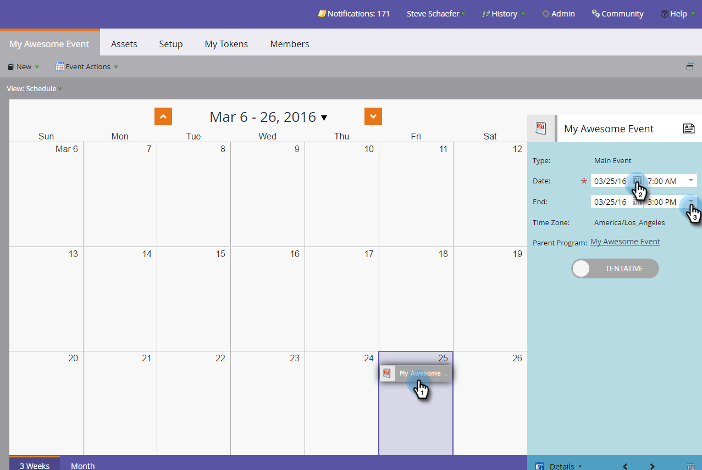

# Een nieuw gebeurtenisprogramma maken {#create-a-new-event-program}

Met gebeurtenissen kunt u online en offline gebeurtenissen automatiseren! Leg de status van uw mensen vast terwijl ze verschillende fasen doorlopen en profiteer van nauwkeurige maatstaven van het rendement van uw marketinginitiatieven.

1. Ga naar **[!UICONTROL Marketing Activities]** .

   

1. Selecteer de map voor het nieuwe programma. Selecteer **[!UICONTROL New]** en klik op **[!UICONTROL New Program]** .

   

1. Kies een naam voor de gebeurtenis. Selecteer vervolgens onder **[!UICONTROL Program Type]** de optie **[!UICONTROL Event]** .

   

1. Selecteer een **[!UICONTROL Channel]** .

   >[!NOTE]
   >
   >De kanalen bepalen de verschillende status een persoon in een programma kan hebben. Leer meer over [&#x200B; programmalidmaatschap &#x200B;](/help/marketo/product-docs/core-marketo-concepts/programs/creating-programs/understanding-program-membership.md) hier.

   

1. Klik op **[!UICONTROL Create]**.

   

   da! Uw nieuwe gebeurtenis wordt nu in de structuur weergegeven.

   

1. Als u de gebeurtenis wilt plannen, selecteert u **[!UICONTROL Schedule View]** en klikt u erop in de kalender om de pop-up te openen. Voer datums en tijden in.

   

1. Schuif de balk naar **[!UICONTROL Confirmed]** als u klaar bent.

   

Zodra uw gebeurtenis wordt gecreeerd, bouw de [&#x200B; landende pagina&#39;s &#x200B;](/help/marketo/product-docs/demand-generation/landing-pages/free-form-landing-pages/create-a-free-form-landing-page.md), [&#x200B; vormen &#x200B;](/help/marketo/product-docs/demand-generation/forms/creating-a-form/create-a-form.md), en [&#x200B; e-mails &#x200B;](/help/marketo/product-docs/email-marketing/email-programs/creating-an-email-program/create-an-email-program.md) om uw gasten uit te nodigen! U zult ook vertrouwd met de [&#x200B; mening van het programmaprogramma &#x200B;](https://docs.marketo.com/display/docs/program+schedule+view) willen worden.

>[!MORELIKETHIS]
>
>* [&#x200B; Marketing Kalender &#x200B;](/help/marketo/product-docs/core-marketo-concepts/marketing-calendar/understanding-the-calendar/navigating-the-marketing-calendar.md)
>* [&#x200B; Gebruikend de Kosten van de Periode in een Programma &#x200B;](/help/marketo/product-docs/core-marketo-concepts/programs/working-with-programs/using-period-costs-in-a-program.md)
