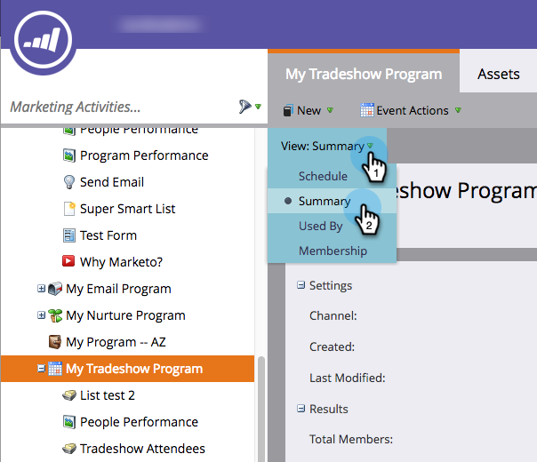

# Een gebeurteniskanaal bewerken {#edit-an-event-channel}

U kunt het kanaaltype van het 0&rbrace; Summiere **lusje van de gebeurtenis of van zijn** Opstelling **tabel uitgeven.**

>[!NOTE]
>
>Deze optie is alleen beschikbaar voor gebeurtenissen waaraan geen leden zijn gekoppeld. Als een gebeurtenis leden heeft, kunt u het kanaaltype niet meer wijzigen.

>[!NOTE]
>
>Een programma is een specifiek marketinginitiatief. Het **kanaal** is voorgenomen om het leveringsmechanisme, zoals Webinar, Tradeshow, of Online Advertentie te zijn. U kunt verschillende kanaalopties in uw drop-down zien, afhankelijk van wat in uw eigen instantie beschikbaar is. U kunt ook [&#x200B; uw eigen kanaal &#x200B;](/help/marketo/product-docs/administration/tags/create-a-program-channel.md) tot stand brengen.

## Via het tabblad Overzicht {#from-the-summary-tab}

1. Selecteer in **[!UICONTROL Marketing Activities]** de gebeurtenis in de boomstructuur.

   

1. Navigeer naar de weergave **[!UICONTROL Summary]** .

   

1. Selecteer onder de categorie **[!UICONTROL Settings]** de huidige **[!UICONTROL Channel]** die als hyperlink wordt weergegeven.

   

1. Selecteer een nieuwe **[!UICONTROL Channel]** in de vervolgkeuzelijst.

   

1. Klik op **[!UICONTROL Save]**.

   

## Via het tabblad Setup {#from-the-setup-tab}

Een nieuw kanaaltype kan ook worden toegewezen vanaf het tabblad **[!UICONTROL Setup]** van de gebeurtenis.

1. Selecteer de gebeurtenis in de boomstructuur.

   

1. Navigeer naar de tab **[!UICONTROL Setup]** . Dubbelklik het huidige **Kanaal**.

   

1. Selecteer een nieuwe **[!UICONTROL Channel]** .

   

1. Klik op **[!UICONTROL Save]**.

   

Gefeliciteerd! U hebt zojuist een kanaal bewerkt!
