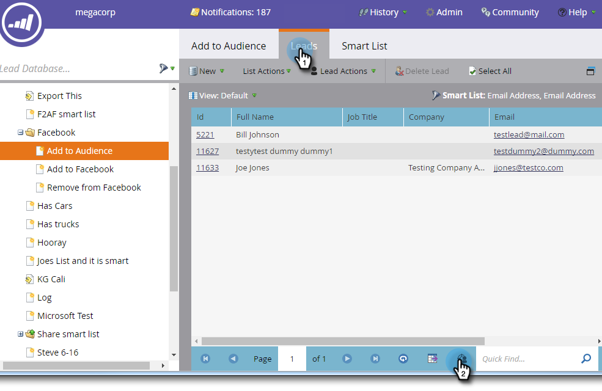
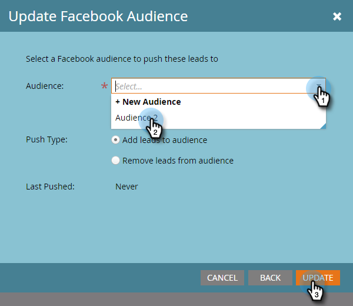

# Regels toevoegen aan een aangepast publiek in [!DNL Facebook] {#add-leads-to-a-custom-audience-in-facebook}

Hebt u al een aangepast publiek in [!DNL Facebook] en wilt u er meer leads aan toevoegen? Zo gaat het.

>[!PREREQUISITES]
>
>* [&#x200B; creeer een Publiek van de Douane in  [!DNL Facebook]](/help/marketo/product-docs/demand-generation/facebook/create-a-custom-audience-in-facebook.md)
>* [&#x200B; keurt {de termijnen van 1} van het douanepubliek  [!DNL Facebook] binnen uw &#x200B;](https://www.facebook.com/ads/manage/customaudiences/tos.php) rekening goed.[!DNL Facebook]
>

1. Zoek en selecteer de slimme of statische lijst met de leads die u wilt toevoegen.

   

1. Selecteer het **[!UICONTROL Leads]** lusje, dan klik op **verzenden via Ad Bridge** pictogram bij de bodem.

   

1. Selecteer **[!UICONTROL Facebook]** en klik op **[!UICONTROL Next]** .

   

1. Klik op de vervolgkeuzelijst **[!UICONTROL Audience]** , selecteer het publiek waaraan u de leads wilt toevoegen en klik op **[!UICONTROL Update]** .

   

   >[!NOTE]
   >
   >**[!UICONTROL Add leads to audience]** : alleen [!DNL Facebook] publiek met een aangepast subtype is beschikbaar.
   >**[!UICONTROL Remove leads from audience]** : hiermee verwijdert u de leads in uw statische of slimme lijst uit een [!DNL Facebook] -publiek.

1. Als u klaar bent, wordt de status bijgewerkt.

   

   Dat is alles wat er aan te pas komt!

   >[!NOTE]
   >
   >[&#x200B; creeer een Publiek van de Douane in  [!DNL Facebook]](/help/marketo/product-docs/demand-generation/facebook/create-a-custom-audience-in-facebook.md)
