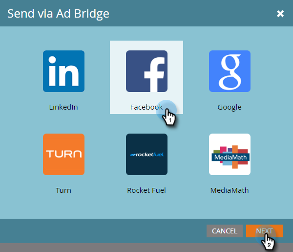

# Leads toevoegen aan een aangepast publiek in Facebook {#add-leads-to-a-custom-audience-in-facebook}

Hebt u al een aangepast publiek in Facebook en wilt u er meer leads aan toevoegen? Zo gaat het.

>[!PREREQUISITES]
>
>* [Een aangepast publiek maken in Facebook](/help/marketo/product-docs/demand-generation/facebook/create-a-custom-audience-in-facebook.md)
>* [Aangepaste voorwaarden voor Facebook-publiek accepteren](https://www.facebook.com/ads/manage/customaudiences/tos.php) in uw Facebook-account.
>

1. Zoek en selecteer de slimme of statische lijst met de leads die u wilt toevoegen.

   

1. Selecteer **Leads** en klikt u op de knop **Verzenden via Adobe Bridge** aan de onderkant.

   

1. Selecteren **Facebook** en klik op **Volgende**.

   

1. Klik op de knop **Publiek** vervolgkeuzelijst, selecteert u het publiek waaraan u de leads wilt toevoegen en klikt u op **Bijwerken**.

   

   >[!NOTE]
   >
   >**leads toevoegen aan publiek**: alleen Facebook-publiek met een aangepast subtype is beschikbaar.\
   >**Leden van het publiek verwijderen**: Hiermee verwijdert u de leads in uw statische of slimme lijst van een Facebook-publiek.

1. Als u klaar bent, wordt de status bijgewerkt.

   

   Dat is alles wat er aan te pas komt!

   >[!NOTE]
   >
   >[Een aangepast publiek maken in Facebook](/help/marketo/product-docs/demand-generation/facebook/create-a-custom-audience-in-facebook.md)
