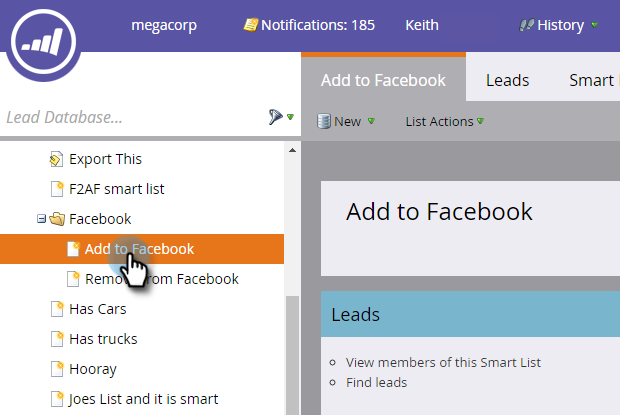

# Een aangepast publiek maken in Facebook {#create-a-custom-audience-in-facebook}

>[!PREREQUISITES]
>
>* [Aangepast publiek voor Facebook toevoegen als een opstartpuntservice](/help/marketo/product-docs/demand-generation/ad-network-integrations/add-facebook-custom-audiences-as-a-launchpoint-service.md) in de sectie Beheer.
>* [Voorwaarden voor aangepast publiek voor Facebook accepteren](https://www.facebook.com/ads/manage/customaudiences/tos.php) in uw Facebook-account.
>

>[!TIP]
>
>Meer informatie over [aangepast publiek in Facebook](https://www.facebook.com/help/341425252616329).

1. Zoek en selecteer de slimme of statische lijst met de leads waaruit u het publiek wilt maken.

   

1. Selecteer **Leads** en klikt u op de knop **Verzenden via Adobe Bridge** aan de onderkant.

   

1. Selecteren **Facebook** en klik op **Volgende**.

   

1. Klik op de knop **Publiek** vervolgkeuzelijst en selecteer **+ Nieuw publiek**.

   

1. Typ in een **Auditienaam**. Klikken **Bijwerken**.

   

   >[!NOTE]
   >
   >Als u meerdere Facebook Ad-accounts hebt, wordt er een vervolgkeuzelijst weergegeven waarin u kunt kiezen in welk Advertentieaccount dit publiek wordt gemaakt.

   >[!TIP]
   >
   >Wilt u een nieuw publiek omwisselen met een bestaand publiek dat momenteel is gekoppeld aan een advertentieset of -groep? Selecteer **Een bestaand publiek vervangen** selectievakje. Dit zal doen **niet** het publiek verwijderen dat wordt vervangen.

1. Als dit is voltooid, wordt het statusdialoogvenster bijgewerkt.

   

   En dat is het! In Facebook zie je het nieuwe publiek in **Advertentiebeheer > Soorten publiek**.

   

   >[!NOTE]
   >
   >Alle lijsten die u naar Facebook drukt, worden statisch. Slimme lijsten in Marketo werken de publiekslijst in Facebook niet automatisch bij om wijzigingen weer te geven die na de overdracht zijn aangebracht.

   >[!TIP]
   >
   >Zie de [Facebook-leerpad voor Marketo-klanten](https://facebook.exceedlms.com/student/enrollments/create_enrollment_from_token/BF9TqSaCvM73PP4ScjhCm4fi). Alles wat u moet weten, van het maken van een Facebook-pagina tot het richten van Facebook-advertenties via Marketo en netwerkintegratie.

   >[!NOTE]
   >
   >[Leads toevoegen aan een aangepast publiek in Facebook](/help/marketo/product-docs/demand-generation/facebook/add-leads-to-a-custom-audience-in-facebook.md)
