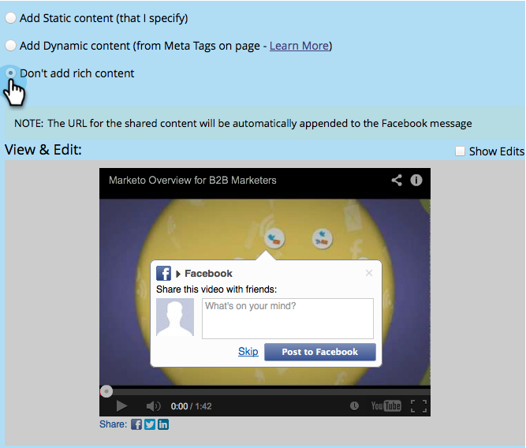
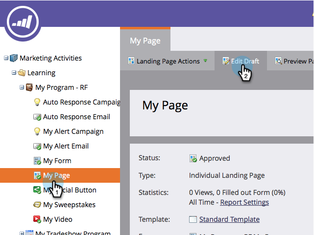

# [!DNL Facebook] Rich Post Settings bewerken {#edit-facebook-rich-post-settings}

Pas advertenties aan wanneer mensen u delen op [!DNL Facebook] .

>[!AVAILABILITY]
>
>Niet alle Marketo Engage-gebruikers hebben deze functionaliteit aangeschaft. Neem contact op met het Adobe-accountteam (uw accountmanager) voor meer informatie.

Marketo _sociale apps_ staat uw lood toe om uw landende pagina&#39;s met hun verbindingen op sociale netwerken zoals Facebook, Twitter, enz. te delen. Met Facebook OpenGraph-tags (OG-tags) kunt u opgeven welke informatie van uw bestemmingspagina in Facebook-berichten wordt opgenomen.

## Opties voor rijke berichten selecteren {#select-rich-post-options}

U kunt de typen pagina-informatie opgeven die moeten worden gebruikt in de [!DNL Facebook] opgemaakte rijke berichten die worden gegenereerd door shares van uw bestemmingspagina.

1. Selecteer **[!UICONTROL Facebook Message]** in de redacteur voor uw * *[!DNL YouTube*]* video of sociale knoop.

   

1. Maak een keuze uit de volgende opties voor uw [!DNL Facebook] -bericht.

   * Statische inhoud toevoegen: selecteer deze optie om de titel, het bijschrift en de beschrijving handmatig in te voeren.

   

   * Dynamische inhoud toevoegen: uw sociale app kan de tags `<TITLE>`, `<CAPTION>` en `<DESCRIPTION>` van uw bestemmingspagina gebruiken om uw rijke advertentie te vullen.

   

   >[!NOTE]
   >
   >Deze zouden al in de paginabron moeten bestaan, maar voor meer controle, kunt u specifieke [!DNL Facebook] markeringen van OG aan uw landende pagina toevoegen.

   * Voeg geen rijke inhoud toe: beperkt de [!DNL Facebook] posten van uw landingspagina tot enkel het belangrijkste bericht en de verbinding.

   

## [!DNL Facebook] OG-tags toevoegen aan een bestemmingspagina {#add-facebook-og-tags-to-a-landing-page}

Als u de pagina-elementen wilt beheren die worden opgenomen in de [!DNL Facebook] -shares van uw bestemmingspagina, kunt u [!DNL Facebook] OG-tags (Open Graph) voor titel, bijschrift en beschrijving toevoegen aan uw bestemmingspagina.

1. Open de het landen pagina die uw **[!DNL YouTube]video** of sociale knoop bevat.

   

   De **[!UICONTROL Landing Page Designer]** wordt in een nieuw venster geopend.

1. Selecteer **[!UICONTROL Landing Page Actions]** > **[!UICONTROL Edit Page Meta Tags]** .

   

1. Voeg HTML toe die begin :title, log :caption, en Logboek :description bepaalt. Kopieer en plak deze regels en vervang de plaatsaanduidingstekst:

   `<meta property="og:title" content="My Post Title"/>`

   `<meta property="og:caption" content="My Post Caption"/>`

   `<meta property="og:description" content="This text appears in the post description"/>`

   

>[!NOTE]
>
>Let op dat u de juiste HTML-syntaxis gebruikt wanneer u de OG-tags toevoegt.
