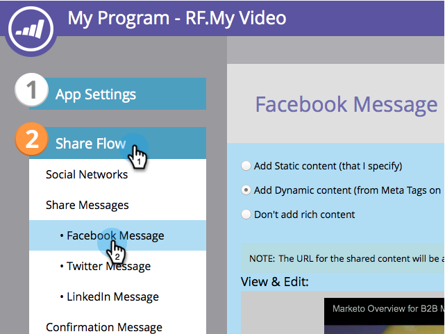

# Facebook Rich Post Settings {#edit-facebook-rich-post-settings} bewerken

Pas advertenties aan wanneer mensen je delen op Facebook.

>[!AVAILABILITY]
>
>Niet alle klanten hebben deze functionaliteit aangeschaft. Neem contact op met je verkoper voor meer informatie.

Marketo [sociale apps](/help/marketo/product-docs/demand-generation/social/social-functions/add-a-social-button-on-a-landing-page.md) maken het mogelijk dat uw leads uw bestemmingspagina&#39;s delen met hun verbindingen op sociale netwerken zoals Facebook, Twitter, enz. Met Facebook OpenGraph-tags (OG-tags) kunt u opgeven welke informatie van uw bestemmingspagina in Facebook-berichten wordt opgenomen.

## Opties voor rijke post selecteren {#select-rich-post-options}

U kunt de typen paginagegevens opgeven die u wilt gebruiken in de uitgebreide Facebook-berichten die worden gegenereerd door shares van uw bestemmingspagina.

1. Selecteer **Facebook-bericht** in de editor voor uw **YouTube** video- of sociale knop.

   

1. Maak een keuze uit de volgende opties voor uw Facebook-bericht.

   * Statische inhoud toevoegen: Selecteer deze optie als u de titel, het bijschrift en de beschrijving handmatig wilt invoeren.

   

   * Dynamische inhoud toevoegen: Uw sociale app kan de tags `<TITLE>`, `<CAPTION>` en `<DESCRIPTION>` van uw bestemmingspagina gebruiken om uw rijke advertentie te vullen.

   

   >[!NOTE]
   >
   >Deze zouden al in de paginabron moeten bestaan, maar voor meer controle, kunt u specifieke markeringen van Facebook OG aan uw landende pagina toevoegen.

   * Voeg geen rijke inhoud toe: Hiermee beperkt u de Facebook-berichten van uw openingspagina tot alleen het hoofdbericht en de koppeling.

   

## Facebook OG-tags toevoegen aan een bestemmingspagina {#add-facebook-og-tags-to-a-landing-page}

Als u de pagina-elementen wilt beheren die vanaf de bestemmingspagina in de Facebook-shares worden opgenomen, kunt u Facebook OG-tags (Open Graph) voor titel, bijschrift en beschrijving toevoegen aan uw bestemmingspagina.

1. Open de openingspagina met uw **YouTube-video** of sociale knop.

   

   De **Landing Page Designer** wordt geopend in een nieuw venster.

1. Selecteer **Handelingen voor het landen van pagina** > **Paginametags bewerken**.

   

1. Voeg de HTML toe die og:title, og:caption, en og:description bepaalt. Kopieer en plak deze regels en vervang de plaatsaanduidingstekst:

   `<meta property="og:title" content="My Post Title"/>`

   `<meta property="og:caption" content="My Post Caption"/>`

   `<meta property="og:description" content="This text appears in the post description"/>`

   

>[!NOTE]
>
>Let op dat u de juiste HTML-syntaxis gebruikt wanneer u de OG-tags toevoegt.
