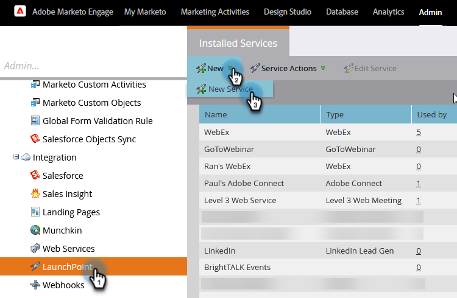

# Advertenties voor Facebook-leads instellen {#set-up-facebook-lead-ads}

Gebruik [&#x200B; Advertentie van de Lood van Facebook &#x200B;](https://www.facebook.com/business/ads/ad-objectives/lead-generation){target="_blank"} om advertentiecampagnes in Facebook in werking te stellen en lood voor Marketo te produceren.

>[!NOTE]
>
>**Vereiste Bevoegdheden Admin**

>[!AVAILABILITY]
>
>Neem contact op met het Adobe-accountteam (uw accountmanager) om Facebook-advertenties aan uw exemplaar toe te voegen.

1. In Marketo Engage, ga naar het **Admin** gebied.

   

1. Ga naar **LaunchPoint**, klik **Nieuwe** drop-down en selecteer **Nieuwe Dienst**.

   

1. Voer een **[!UICONTROL Display Name]** voor uw service in, selecteer de service **[!UICONTROL Facebook Lead Ads]** in de vervolgkeuzelijst en klik op **[!UICONTROL Create]** .

   

1. Open een nieuw lusje in zelfde browser en ga naar [&#x200B; facebook.com &#x200B;](https://www.facebook.com){target="_blank"}. Meld u aan bij Facebook met het account dat u voor de integratie wilt gebruiken.

   >[!NOTE]
   >
   >Het [!DNL Facebook] -account heeft toegang nodig tot alle [!DNL Facebook] -zakelijke pagina&#39;s waaruit u lead-advertenties wilt ophalen.

   

1. Ga terug naar Marketo en klik op [!DNL Facebook] nadat u zich hebt aangemeld bij **[!UICONTROL Authorize]** .

   

1. Klik desgevraagd op **[!UICONTROL OK]** om de installatie van de Marketo-app in [!DNL Facebook] te accepteren.

   

1. Je ziet dat je nu geautoriseerd bent. Klik op **[!UICONTROL Next]**.

   

1. Selecteer de pagina(&#39;s) waarvan u wilt dat Marketo [!UICONTROL Facebook Lead Ads] trekt en klik op **[!UICONTROL Next]** .

   >[!TIP]
   >
   >Als u geen pagina ziet die u verwacht, controleert u of de account [!DNL Facebook] die wordt gebruikt voor verificatie, is toegevoegd aan de pagina op [!DNL Facebook] en probeert u het opnieuw.

   

1. Als u de standaardovermakingen [!DNL Facebook] voor Marketo-velden wilt accepteren, klikt u gewoon op **[!UICONTROL Create]** .

   >[!TIP]
   >
   >Door de toewijzingen te wijzigen, kunt u aanpassen waar de gegevens van de lead-advertenties in Marketo worden opgeslagen. U kunt ook [&#x200B; trekken in gegevens van de Vragen van de Douane van Advertenties van de Lood &#x200B;](/help/marketo/product-docs/demand-generation/facebook/set-up-facebook-lead-ads/map-custom-fields-to-marketo.md){target="_blank"}.

   >[!CAUTION]
   >
   >Marketo biedt geen ondersteuning voor het toewijzen van twee [!DNL Facebook] -velden aan één Marketo-veld, slechts 1 tot 1. Als u de punten 2 tot 1 opgeeft, kunnen leads het Marketo-systeem mogelijk niet betreden.

   

   Echt waar! Leads gaan naar Marketo wanneer u succesvolle campagnes voor advertenties in [!DNL Facebook] uitvoert.

   

>[!MORELIKETHIS]
>
>* [&#x200B; Wijs/verwijder Toestemmingen in de Manager van de Toegang van Leads (Facebook) toe &#x200B;](https://www.facebook.com/business/help/540596413257598?id=735435806665862){target="_blank"}
>* [&#x200B; de Filters en de Trekkers van de Advertentie van het Gebruik van het Lood in een Slimme Campagne &#x200B;](/help/marketo/product-docs/demand-generation/facebook/use-lead-ads-filters-and-triggers-in-a-smart-campaign.md){target="_blank"}
>* [&#x200B; de Gebieden van de Aangepaste Kaart aan Marketo &#x200B;](/help/marketo/product-docs/demand-generation/facebook/set-up-facebook-lead-ads/map-custom-fields-to-marketo.md){target="_blank"}
