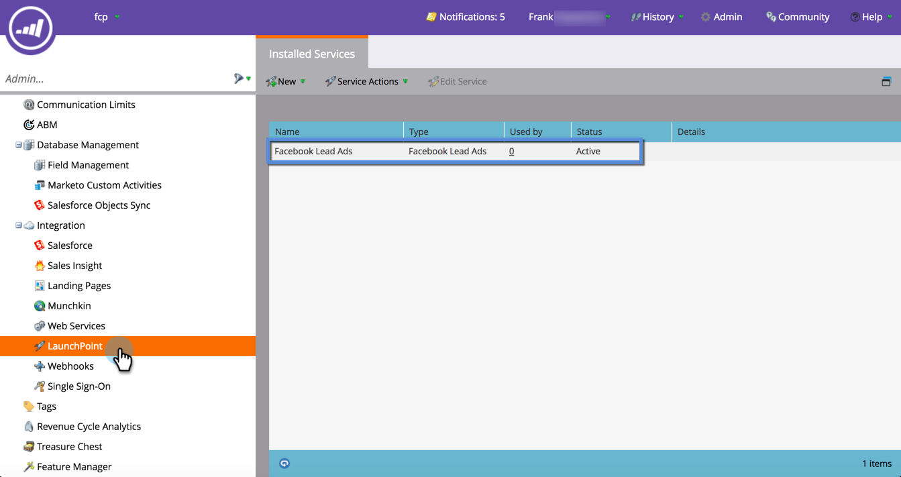
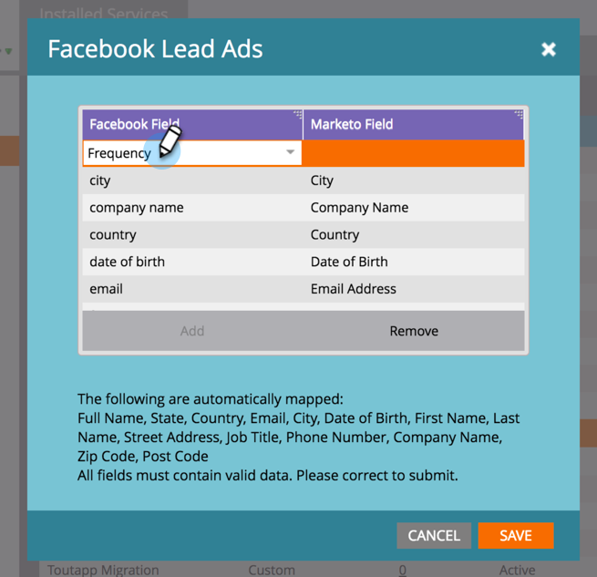

# Aangepaste velden toewijzen aan Marketo {#map-custom-fields-to-marketo}

Mogelijk wilt u meer dan de standaardgegevens verzamelen die [!DNL Facebook] standaard opslaat, bijvoorbeeld hoe vaak iemand uw onlinebezorgingsservice gebruikt. U kunt dit verwezenlijken door [&#x200B; het creëren van douanevragen &#x200B;](https://www.facebook.com/business/help/774623835981457?helpref=uf_permalink) in uw [!DNL Facebook] lood advertenties.

Nochtans, **Marketo zal niet automatisch beginnen deze gegevens** te verzamelen. Opdat Marketo begint de waarden van het douanegebied te vangen, moet u **&#x200B;**&#x200B;die douanegebieden aan een gebied in Marketo in kaart brengen.

Hieronder wordt beschreven hoe u dit instelt in het gebied LaunchPoint van Admin.

>[!NOTE]
>
>**Vereiste Bevoegdheden Admin**

1. Ga naar het gebied Beheer en klik op **[!UICONTROL LaunchPoint]** . Zoek en bewerk **[!UICONTROL Facebook Lead Ads]** onder Geïnstalleerde services.

   

1. Klik op **[!UICONTROL Next]**.

   

1. Verlaat de erkende rekening zoals is-doe **geen** om het even welke veranderingen aanbrengt. Klik op **[!UICONTROL Next]**.

   

1. Zoals voordien, verlaat de geselecteerde pagina&#39;s zoals is-doet **geen** veranderingen aanbrengen. Klik op **[!UICONTROL Next]**.

   

1. Hier ziet u hoe u het aangepaste [!DNL Facebook] veld toewijst aan uw Marketo-veld. Klik op **[!UICONTROL Add].**

   

1. Voer in de nieuwe rij de naam in van het aangepaste veld [!DNL Facebook] .

   

   >[!NOTE]
   >
   >Alleen velden die zijn opgeslagen in [!DNL Facebook] formuliersjablonen worden hier als opties weergegeven.

1. Klik in de kolom **[!UICONTROL Marketo Field]** . Typ om te zoeken naar het veld waaraan u wilt toewijzen. Als u een veld hebt geselecteerd, klikt u op **[!UICONTROL Save]** .

   

   >[!NOTE]
   >
   >Als u reeds geen gebied in Marketo hebt om het [!DNL Facebook] gebied in kaart te brengen aan, leer hoe te [&#x200B; douanegebieden &#x200B;](/help/marketo/product-docs/administration/field-management/create-a-custom-field-in-marketo.md) creëren.

>[!CAUTION]
>
>U **moet** door dit proces voor om het even welk nieuw [!DNL Facebook] gebied gaan opdat Marketo de gegevens verzamelt.
