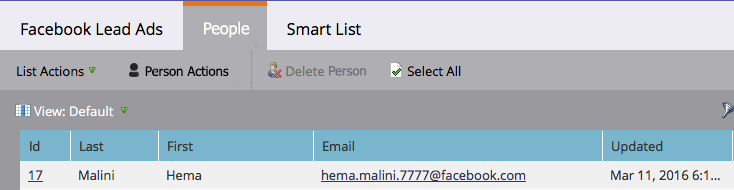

# Testen [!DNL Facebook] Advertenties voor desktopintegratie met Marketo {#test-facebook-lead-ads-for-desktop-integration-with-marketo}

Nadat je je advertentie hebt gemaakt, moet je deze testen. Zo doe je het op je bureaublad.

>[!PREREQUISITES]
>
>U moet [&#x200B; Opstelling de [!UICONTROL Facebook Lead Ads] Integratie &#x200B;](/help/marketo/product-docs/demand-generation/facebook/set-up-facebook-lead-ads.md).

1. Selecteer in de Facebook Power Editor een campagne, een advertentie en klik op **[!UICONTROL Edit]** .

1. Klik onder **[!UICONTROL Links]** op de koppeling **[!UICONTROL View in News Feed]** .

   

1. U wordt op een nieuw tabblad in uw browser naar [!DNL Facebook] geleid. Klik op de [!UICONTROL Call to Action] in de [!DNL Facebook] advertentie-eenheid voor lead.

   

   >[!NOTE]
   >
   >Dit is slechts een voorbeeld, dat een Learn More Call to action gebruikt. Je advertentie-eenheid Call to action kan anders zijn.

1. Verzend uw testadvertentie-eenheid door het formulier op uw bureaublad in te vullen. Klik op **[!UICONTROL Submit]**.

   

1. Gefeliciteerd. Je bent klaar met het verzenden van het advertentieformulier.

   

1. Daar gebeurt de magie! Zodra u uw vorm hebt voorgelegd, [&#x200B; bouwt een slimme lijst in Marketo &#x200B;](/help/marketo/product-docs/core-marketo-concepts/smart-lists-and-static-lists/creating-a-smart-list/create-a-smart-list.md) als deel van een programma of in het gegevensbestand dat de Gevulde [!DNL Facebook] filter van de Vorm van de Advertentie van de Lood gebruikt. Voeg de naam in van het formulier dat u zojuist hebt verzonden en voeg het formulier voor advertentie-informatie toe.

   

1. Klik nu op het tabblad **[!UICONTROL People]** om te controleren of de synchronisatie correct werkt.

   

   Is dat cool of zo?

>[!MORELIKETHIS]
>
>[&#x200B; Instellen [!UICONTROL Facebook Lead Ads]](/help/marketo/product-docs/demand-generation/facebook/set-up-facebook-lead-ads.md)
