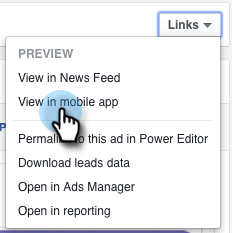

# Advertenties van Facebook voor mobiele integratie testen met Marketo {#test-facebook-lead-ads-for-mobile-integration-with-marketo}

Nadat je je advertentie hebt gemaakt, moet je deze testen.

>[!PREREQUISITES]
>
>U moet [De integratie van de Advertentie van de Lood van Facebook ](set-up-facebook-lead-ads.md) plaatsen.

1. Selecteer in de Facebook Power Editor een campagne, een advertentie en klik op **Bewerken**.
1. Klik onder **Koppelingen** op de koppeling **Weergeven op mobiele app**.

   

1. Er wordt een nieuw bericht verzonden naar het Facebook-account dat u via het geautoriseerde account kunt openen op het mobiele apparaat. Klik **OK**.

   

1. Tik op uw mobiele apparaat op **Meldingen** in de mobiele app van Facebook.

   

1. Tik in Meldingen op **Uw advertentie is klaar om voor te vertonen**.

   

1. Verzend uw eenheid van de Advertentie van de testlood door uw Vraag aan Actie te tikken en het formulier in te vullen u creeerde.

   

   >[!NOTE]
   >
   >Dit is slechts een voorbeeld, dat Leer Meer Vraag aan Actie gebruikt. Je oproep van advertentie-eenheid naar actie kan anders zijn.

1. Daar gebeurt de magie! Als u het formulier hebt verzonden, maakt u [een slimme lijst in Marketo](../../../product-docs/core-marketo-concepts/smart-lists-and-static-lists/creating-a-smart-list/create-a-smart-list.md) als onderdeel van een programma of in de hoofddatabase die het filter **Filled Out Facebook Lead Ads Form** gebruikt. Voeg de naam in van het formulier dat u zojuist hebt verzonden en voeg het formulier voor advertentie-informatie toe.

   

1. Klik nu op het tabblad Leads om te controleren of de synchronisatie naar behoren werkt.

   

   Is dat cool of zo?

>[!NOTE]
>
>**Verwante artikelen**
>
>* [Advertenties Facebook inschakelen/uitschakelen](set-up-facebook-lead-ads.md)

>

