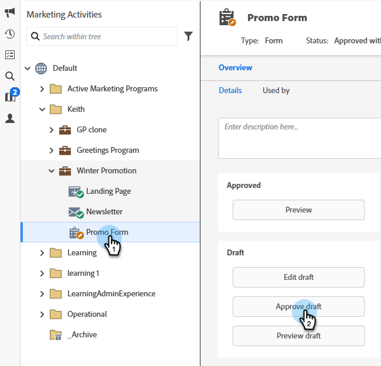

# Een formulier goedkeuren {#approve-a-form}

Als u een formulier aan een van uw bestemmingspagina&#39;s wilt toevoegen, moet het zijn goedgekeurd.

## Een formulier goedkeuren {#approve}

Hieronder wordt beschreven hoe u een bestaand formulier goedkeurt dat klaar is om te worden gebruikt.

1. Ga naar **[!UICONTROL Marketing Activities]** .

   

1. Selecteer het gewenste formulier en klik op **[!UICONTROL Approve draft]** .

   

   Er wordt een groen vinkje weergegeven.

   

   Het is goedgekeurd en klaar om [ aan een het landen Pagina ](/help/marketo/product-docs/demand-generation/landing-pages/understanding-landing-pages/approve-unapprove-or-delete-a-landing-page.md){target="_blank"} worden toegevoegd.

   >[!NOTE]
   >
   >Wijzigingen die u na goedkeuring aanbrengt, kunnen enkele minuten duren om bij te werken op ingesloten formulieren.

## Een formulier goedkeuren in de Editor {#approve-from-the-editor}

U kunt een formulier rechtstreeks vanuit de formuliereditor goedkeuren.

>[!PREREQUISITES]
>
>[ geef een Vorm ](/help/marketo/product-docs/demand-generation/forms/form-actions/edit-a-form.md) uit

1. Klik in het formulier op **[!UICONTROL Finish]** .

   

1. Klik op **[!UICONTROL Approve and Close]**.

   
