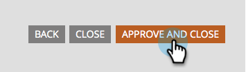

# Een formulierveld vereist maken {#make-a-form-field-required}

Wanneer [&#x200B; toevoegend gebieden aan een vorm &#x200B;](/help/marketo/product-docs/demand-generation/forms/creating-a-form/add-a-field-to-a-form.md){target="_blank"}, kunt u enkelen van hen willen maken die worden vereist aan de persoon die hen invult. Zo gaat het.

1. Ga naar **[!UICONTROL Marketing Activities]** .

   

1. Selecteer het formulier en klik op **[!UICONTROL Create draft]** .

   

   >[!NOTE]
   >
   >Als uw vorm niet wordt goedgekeurd, klik **ontwerp** uitgeven.

1. Selecteer het veld dat u verplicht wilt maken en schakel **[!UICONTROL Is Required]** in.

   

1. Echt waar! Klik op **[!UICONTROL Finish]**.

   

1. Klik op **[!UICONTROL Approve and Close]**.

   

>[!NOTE]
>
>Vergeet niet [&#x200B; om het even welke het Bestaan Pagina&#39;s &#x200B;](/help/marketo/product-docs/demand-generation/landing-pages/understanding-landing-pages/approve-unapprove-or-delete-a-landing-page.md){target="_blank"} goed te keuren deze vorm leeft op voor de veranderingen om levend te gaan.

>[!MORELIKETHIS]
>
>[&#x200B; opnieuw orde de gebieden u aan uw vorm &#x200B;](/help/marketo/product-docs/demand-generation/forms/form-fields/reorder-fields-in-a-form.md){target="_blank"} toevoegde
