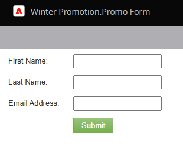

# Een voorbeeld van een formulier bekijken {#preview-a-form}

Voordat u publiceert, kunt u het formulier bekijken in deze snelle en eenvoudige voorbeeldweergave.

1. Ga naar **[!UICONTROL Marketing Activities]** .

   

1. Selecteer het formulier en klik op **[!UICONTROL Preview]** .

   

   >[!NOTE]
   >
   >Als uw vorm niet wordt goedgekeurd, klik **het ontwerp van de Voorproef**.

1. De vormredacteur zal op _voorproef_ wijze openen.

   

1. Klik **[!UICONTROL Edit Draft]** om terug naar _te gaan geef_ wijze uit.

   

1. Ga eenvoudig terug door op **[!UICONTROL Preview Draft]** te klikken.

   
