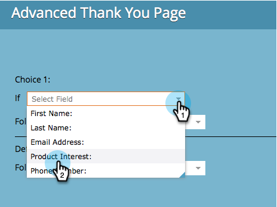

# Een pagina voor bedankt formulier instellen {#set-a-form-thank-you-page}

Wat gebeurt er als iemand een formulier invult? Waar worden ze doorgestuurd naar? Hier is hoe te om het te vormen.

## Formulier bewerken {#edit-form}

1. Ga naar **[!UICONTROL Marketing Activities]** .

   

1. Selecteer het formulier en klik op **[!UICONTROL Edit Form]** .

   

1. Klik onder **[!UICONTROL Form Settings]** op **[!UICONTROL Settings]** .

   

1. Schuif omlaag naar de sectie **[!UICONTROL Thank You Page]** .

## Op de pagina blijven {#stay-on-page}

Met de optie Op pagina blijven houdt u de bezoeker op dezelfde pagina wanneer het formulier is verzonden.

1. Selecteer **[!UICONTROL Stay On Page]** voor **[!UICONTROL Follow Up With]** .

   

## Externe URL {#external-url}

Met de instelling Externe URL kunt u elke URL definiëren als de vervolgpagina. Nadat de gebruiker het formulier heeft verzonden, wordt deze naar de opgegeven URL geleid.

1. Selecteer **[!UICONTROL External URL]** voor **[!UICONTROL Follow Up With]** .

   

1. Voer de volledige URL in.

   

>[!TIP]
>
>De URL kan die van een dossier zijn ergens wordt ontvangen - als u dit doet, zal &quot;[!UICONTROL Submit]&quot;knoop zich als &quot;[!UICONTROL Download]&quot;knoop gedragen.

## Openingspagina {#landing-page}

U kunt elke goedgekeurde Marketo-bestemmingspagina selecteren als follow-up.

1. Stel **[!UICONTROL Follow Up With]** in op **[!UICONTROL Landing Page]** .

   

1. Zoek en selecteer de gewenste bestemmingspagina.

   

## Dynamisch bedankt voor uw pagina&#39;s {#dynamic-thank-you-pages}

U kunt meerdere opties toevoegen en keuzes inbouwen om mensen verschillende follow-ups te laten zien, afhankelijk van hun reacties.

1. Klik op **[!UICONTROL Add Choice]**.

   

1. Selecteer het gebied u de reactie van wilt controleren.

   

   >[!TIP]
   >
   >Hiervoor zijn alleen velden beschikbaar die aan het formulier zijn toegevoegd.

1. Selecteer de gewenste logische operator.

   

1. Voer een van de waarden in waarop de gebruiker reageert.

   

1. Kies de juiste pagina voor **[!UICONTROL Follow Up With]** type.

   

1. Selecteer de juiste bestemmingspagina.

   

   >[!NOTE]
   >
   >U moet deze bestemmingspagina&#39;s voor tijd hebben gecreeerd/goedgekeurd.

1. Klik op het plusteken **+** om een andere keuze toe te voegen.

   

   >[!NOTE]
   >
   >U kunt verschillende opties toevoegen. Als u echter te veel toevoegt, kan dit van invloed zijn op de laadsnelheid van het formulier. Voeg dus alleen toe wat u nodig hebt.

1. Doorgaan en instellen **[!UICONTROL Choice 2]** .

   

   >[!TIP]
   >
   >Voel vrij om opvolgingstypen te mengen en aan te passen. U kunt een bestemmingspagina voor één keus en een URL voor een andere gebruiken.

1. Stel een standaardpagina in voor alle andere reacties.

   

1. Selecteer de pagina zelf en klik op **[!UICONTROL Save]** .

   

   Oké, ziet er goed uit!

   

1. Klik op **[!UICONTROL Finish]**.

   

1. Klik op **[!UICONTROL Approve and Close]**.

   

Geweldig werk!
