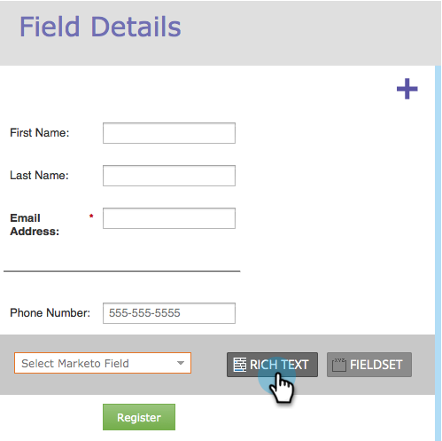

# Rijke tekst toevoegen aan een formulier {#add-rich-text-to-a-form}

Gebruik RTF-tekst in een formulier om instructies of andere informatie tussen velden toe te voegen. Bekijk het.

1. Ga naar **Marketingactiviteiten**.

   

1. Selecteer het formulier en klik op **Formulier bewerken**.

   

1. Klik op de knop **+** ondertekenen.

   

1. Selecteren **RTF**.

   

1. Voer de gewenste tekst in.

   

   >[!TIP]
   >
   >Als u een lijnscheidingsteken in het formulier nodig hebt, gebruikt u de knop Horizontale lijn.

1. Klikken **Opslaan**.

   

1. Klikken **Voltooien**.

   

1. Klikken **Goedkeuren en Sluiten**.

   

   Echt waar! Bekijk het.

   

>[!TIP]
>
>Wist u dat u ook [zichtbaarheidsregels toevoegen](/help/marketo/product-docs/demand-generation/forms/form-fields/dynamically-toggle-visibility-of-a-form-field.md) naar een tekstblok met tekstopmaak?
