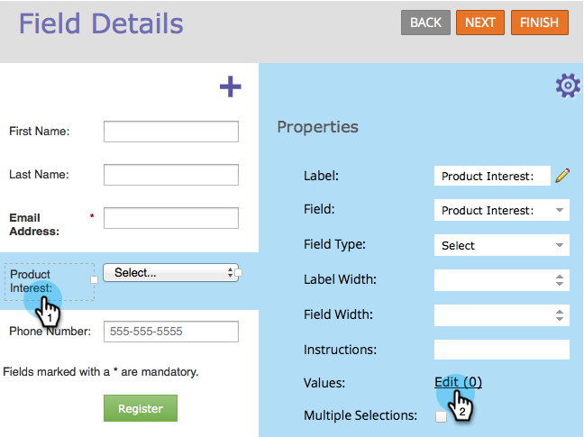

# Waarden definiëren in een keuzerondje of geselecteerd veld in een formulier {#define-values-in-a-radio-or-selected-field-in-a-form}

Eenmaal [een veldtype instellen](/help/marketo/product-docs/administration/field-management/change-the-type-of-a-marketo-custom-field.md) Als u een keuzerondje wilt zijn of tekst wilt selecteren, kunt u de waarden definiëren waaruit de gebruiker kan kiezen. Zo gaat het.

1. Ga naar **Marketingactiviteiten**.

   

1. Selecteer het formulier en klik op **Formulier bewerken**.

   

1. Selecteer het veld en klik op **Bewerken**.

   

   >[!NOTE]
   >
   >De eerste en standaardwaarde zijn altijd &quot;Selecteren...&quot; Voel u vrij om dat te bewerken. Als u het standaardkeuzerondje wijzigt in een andere rij, selecteert u Selecteren... verschijnt niet als een keuze in het formulier.

1. Klik om uw waarde toe te voegen.

   

   >[!NOTE]
   >
   >**Definitie**
   >
   >**Weergavewaarde:** Wat wordt getoond aan de bezoeker.
   >
   >**Opgeslagen waarde:** Wat wordt er opgenomen in Marketo.

1. Voeg zoveel waarden toe als u nodig hebt en klik op **Opslaan**.

   >[!NOTE]
   >
   >Als je geen opgeslagen waarde opgeeft, gebruikt Marketo de weergavewaarde en slaat die op.

   

   >[!TIP]
   >
   >Klikken **Geavanceerde editor** om desgewenst een lijst met waarden te kopiëren/plakken. Het kan in real-time besparen zijn.

1. Klikken **Voltooien**.

   

1. Klikken **Goedkeuren en Sluiten**.

   

Super werk! Je doet het heel goed.
