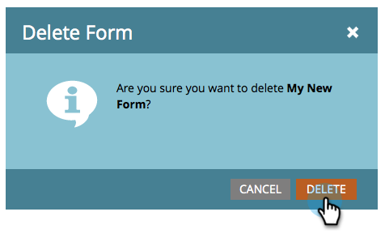

# Een formulier verwijderen {#delete-a-form}

Als u een formulier hebt dat u niet nodig hebt en niet gebruikt, kunt u het verwijderen. Zo gaat het.

1. Ga naar **[!UICONTROL Marketing Activities]** .

   

1. Zoek en selecteer het formulier.

   

1. Klik onder **[!UICONTROL Form Actions]** op **[!UICONTROL Delete Form]** .

   

   >[!NOTE]
   >
   >Vergeet niet het formulier te verwijderen van alle/willekeurige bestemmingspagina&#39;s die het gebruiken. Bevestig ook dat het formulier niet wordt gebruikt op een openbare website.

1. Bevestig door op **[!UICONTROL Delete]** te klikken.

   

1. Als het formulier wordt gebruikt op een Marketo-openingspagina, kunt u het niet verwijderen. Je moet het verwijderen van de landingspagina&#39;s waar het op leeft.

   

>[!CAUTION]
>
>Als u een formulier verwijdert dat wordt gebruikt door uw openbare website, wordt er geen waarschuwing weergegeven en wordt het formulier verbroken. Overweeg [&#x200B; archiverend het &#x200B;](/help/marketo/product-docs/email-marketing/drip-nurturing/using-stream-content/archive-and-unarchive-stream-content.md) in plaats daarvan.
