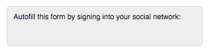

# [!DNL LinkedIn] Veelgestelde vragen over het invullen van sociale formulieren {#linkedin-social-form-fill-faqs}

Het herziene API-beleid van [!DNL LinkedIn] vereist dat we [!DNL LinkedIn] Vulling van sociaal formulier uit ons product verwijderen.

## Belangrijke zaken om te weten {#important-things-to-know}

* [!DNL LinkedIn] De knoppen voor het invullen van sociale formulieren zijn op 28 april 2016 niet meer toegevoegd aan Marketo

* De knop Vulling van sociaal formulier [!DNL LinkedIn] is verwijderd uit alle formulieren waarvoor deze is ingeschakeld

## Waarom is deze functionaliteit verwijderd uit mijn Marketo-abonnement? {#why-was-this-functionality-removed-from-my-marketo-subscription}

LinkedIn heeft belangrijke wijzigingen aangebracht in het ontwikkelaarsprogramma. Als onderdeel van deze wijzigingen kan Marketo deze functionaliteit niet meer voor klanten ondersteunen.

## Wat is er gebeurd als ik de knop [!DNL LinkedIn] Vulling van sociaal formulier niet heb verwijderd uit mijn formulieren waarvoor sociaal formulier is ingeschakeld? {#what-happened-if-i-didnt-remove-the-linkedin-social-form-fill-buttons-from-my-forms-that-had-social-form-enabled}

Op 28 april 2016 hebben we de knop [!DNL LinkedIn] Vulling van sociaal formulier verwijderd uit formulieren waarvoor het sociale formulier nog steeds is ingeschakeld.

## Ik voeg deze functionaliteit op formulieren in sinds we een Marketo-klant zijn geworden. Hoe weet ik welke formulieren gebruikten van [!DNL LinkedIn] Vulling van sociaal formulier? {#i-have-been-inserting-this-functionality-on-forms-since-we-became-a-marketo-customer-how-do-i-know-which-forms-were-using-linkedin-social-form-fill}

Voordat we deze wijziging hebben aangebracht, hebben we wekelijkse meldingen verzonden naar het Postvak IN met een lijst met formulieren die zijn gebruikt voor [!DNL LinkedIn] Vulling van sociaal formulier. Deze waarschuwingen zijn bedoeld om u te helpen identificeren waar u deze functionaliteit gebruikte.

## Werken de [!DNL LinkedIn] knoppen voor sociaal delen nog steeds? {#do-linkedin-social-sharing-buttons-still-work}

Ja. De wijziging is alleen van invloed op de functie voor het invullen van sociale formulieren van [!DNL LinkedIn] .

## Werken [!DNL Facebook] en [!DNL Twitter] Vulling van sociaal formulier nog steeds? {#do-facebook-and-twitter-social-form-fill-still-work}

Ja. [!DNL Facebook] en [!DNL Twitter] Vulling van sociaal formulier zijn niet gewijzigd.

## Is er iets gebeurd met de gegevens die we al hebben vastgelegd via [!DNL LinkedIn] Vulling sociaal formulier? {#did-anything-happen-to-the-data-we-already-captured-via-linkedin-social-form-fill}

Nee, deze gegevens zijn al opgeslagen in het persoonrecord in Marketo en zijn niet beïnvloed door deze wijziging.

## Waar kan ik meer informatie over het beleid van LinkedIn API vinden? {#where-can-i-find-more-information-about-linkedin-s-api-policy}

Volg deze verbinding om meer over de veranderingen [!DNL LinkedIn] te leren die aan hun API beleid worden aangebracht: [ https://developer.linkedin.com/blog/posts/2015/developer-program-changes ](https://developer.linkedin.com/blog/posts/2015/developer-program-changes)

## Hoe kan ik contact opnemen met [!DNL LinkedIn] met vragen? {#how-can-i-contact-linkedin-with-questions}

Volg deze verbinding aan contact [!DNL LinkedIn] over hun Oplossingen van de Marketing: [ https://business.linkedin.com/marketing-solutions/contact-us ](https://business.linkedin.com/marketing-solutions/contact-us)

## Als Marketo deze functie op 28 april uit mijn formulieren had verwijderd, werden mijn formulieren en de betreffende landingspagina&#39;s dan in de ontwerpmodus gezet? {#if-marketo-removed-this-functionality-from-my-forms-on-april-were-my-forms-and-the-affected-landing-pages-put-into-draft-mode}

Nee, uw formulieren waarvan we deze functie hebben verwijderd, zijn gepubliceerd.

## Als [!DNL LinkedIn] mijn enige geselecteerde netwerk was, zal dit de verschijning van mijn vorm veranderen? {#if-linkedin-was-my-only-selected-network-will-this-change-the-appearance-of-my-form}

Nee, alleen de knop [!DNL LinkedIn] wordt uit het formulier verwijderd. Telkens wanneer de Vulling van een sociaal formulier op een formulier wordt toegepast, wordt boven het formulier een container gemaakt die de knoppen voor het invullen van het sociale formulier bevat. Vóór 28 april 2016, als [!DNL LinkedIn] de enige optie was, leek de vormgeving van de container op deze afbeelding:

Na 28 april 2016 is er nu een lege container over aan de bovenkant van elk formulier waar [!DNL LinkedIn] Vulling van sociaal formulier is verwijderd:

>[!NOTE]
>
>De bovenstaande afbeeldingen zijn bijvoorbeeld alleen. Dit is mogelijk niet precies hoe de container van de knop Vulling van sociaal formulier wordt weergegeven. Een lettertypekleur, -stijl, enz. U hebt de manier gekozen waarop uw container eruit ziet.

## Als [!DNL LinkedIn] mijn enige geselecteerde netwerk was, hoe kan ik de lege container boven mijn formulier verwijderen? {#if-linkedin-was-my-only-selected-network-how-can-i-remove-the-empty-container-above-my-form}

U kunt de lege container verwijderen door het formulier te bewerken, [!DNL Facebook] of [!DNL Twitter] te selecteren als optie voor Vulling van sociaal formulier en vervolgens [!DNL Facebook] of [!DNL Twitter] te deselecteren als optie voor Vulling van sociaal formulier. Hiermee worden de sociale opties in de formuliervullingcontainer opnieuw ingesteld en uit het formulier verwijderd.
