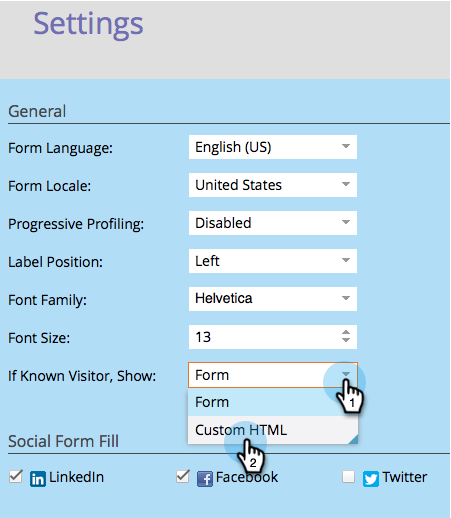

# Aangepast HTML-formulier tonen voor bekende personen {#show-custom-html-form-for-known-people}

Als een bezoeker in het verleden zijn volledige naam en e-mailadres heeft opgegeven en u niet wilt dat deze het hele formulier ophalen, leert u hoe u ze een aangepaste HTML kunt tonen (bijvoorbeeld alleen een downloadknop).

1. Ga naar **de Marketing Activiteiten**.

   

1. Onder **de Activiteiten van de Marketing**, selecteer uw vorm en klik **uitgeven Vorm**.

   

1. Onder **Montages van de Vorm**, klik op **Montages**.

   

1. Plaats als **Bekende Bezoeker, toon**: aan **Eigen HTML**.

   

1. Klik  om de **Douane HTML** uit te geven die aan bekende mensen zal worden getoond.

   

1. Er is wat standaardinhoud, maar u kunt deze aanpassen.

   

   Beschikbare tokens:

   | Token | Beschrijving |
   |---|---|
   | `{{lead.FirstName}}` | Hierdoor wordt de voornaam van de persoon weergegeven. |
   | `{{lead.LastName}}` | Hierdoor wordt de achternaam van de persoon weergegeven. |
   | `{{form.Button:default=Download}}` | Hiermee wordt de formulierknop weergegeven. Vervang het gebied na `=` om de knoptekst te wijzigen. |
   | `{{form.NotYou:default=Not you?}}` | Dit zal een verbinding tonen voor het geval de persoon anders is. Vervang het gebied na de `=` om de koppelingstekst te wijzigen. |

   >[!CAUTION]
   >
   >Alleen de vier bovenstaande tokens kunnen worden gebruikt. Een ander token werkt hier niet.

1. Klik **Afwerking**.

   

1. Klik **goedkeuren en sluiten**.

   >[!NOTE]
   >
   >Het formulier moet zijn goedgekeurd voor gebruik op de aanvoerpagina&#39;s.

   

   >[!NOTE]
   >
   >Herinner me [ goedkeuren het het landen paginaconcept ](/help/marketo/product-docs/demand-generation/landing-pages/understanding-landing-pages/approve-unapprove-or-delete-a-landing-page.md) door de vormveranderingen wordt gecreeerd.

   Stukje cake! Kijk wat een persoon zou zien als hij of zij terugkwam naar de zelfde vorm:

   

   >[!TIP]
   >
   >U kunt de klik van de knop naar het element sturen door de pagina voor formulierfollow-up in te stellen op de URL van het bestand.
