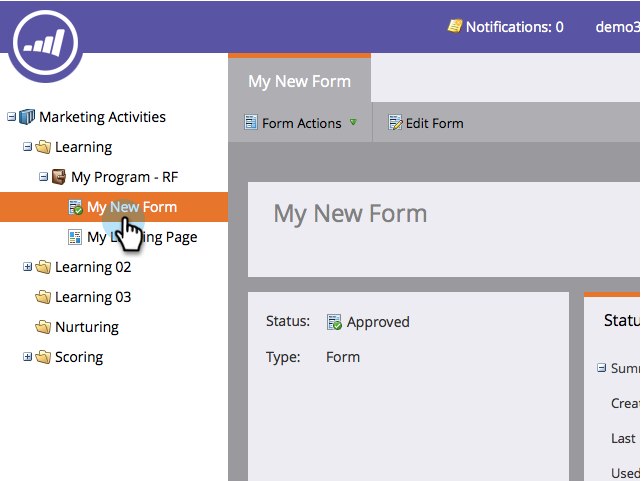
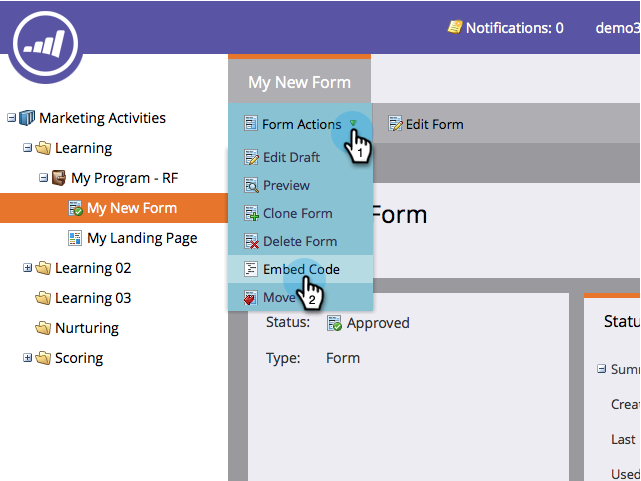
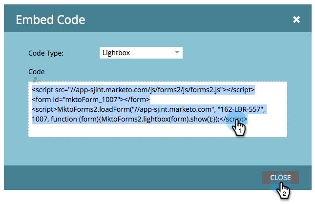

# Een formulier gebruiken in een lichtbak {#use-a-form-in-a-lightbox}

Een lichtbak is een techniek waarmee een formulier vóór de inhoud wordt geopend wanneer u het wilt weergeven. Zo gaat het.

1. Ga naar **Marketingactiviteiten**.

   

1. Zoek en selecteer het formulier.

   

1. Onder **Formulierhandelingen**, klikt u op **Code insluiten**.

   >[!NOTE]
   >
   >Het insluitcode-item kan alleen zichtbaar/gebruikt worden als het formulier is goedgekeurd.

   

1. Set **Type code** tot **Lichtbak**.

   

1. Selecteer/kopieer de code en klik **Sluiten**.

   

Verstuur de code naar uw webontwikkelaar en zorg dat deze de code aan uw website toevoegt.

Geweldig werk!
