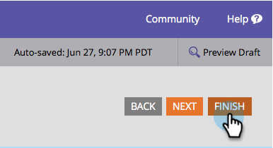
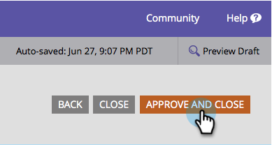

# Positie van formulierlabel wijzigen {#change-form-label-position}

Wanneer [ creërend een vorm ](/help/marketo/product-docs/demand-generation/forms/creating-a-form/create-a-form.md), kunt u het plaatsen van de etiketten van het vormgebied zeer gemakkelijk veranderen. Zo gaat het.

1. Ga naar **[!UICONTROL Marketing Activities]** .

   

1. Selecteer het formulier en klik op **[!UICONTROL Edit Form]** .

   

1. Selecteer **[!UICONTROL Settings]**.

   

1. Selecteer de **[!UICONTROL Label Position]** die u wilt.

   

   U hebt momenteel twee opties:

   * [!UICONTROL Left] (standaardwaarde)
   * [!UICONTROL Above]

1. Klik op **[!UICONTROL Finish]**.

   

1. Klik op **[!UICONTROL Approve and Close]**.

   >[!NOTE]
   >
   >Het formulier moet zijn goedgekeurd voor gebruik op de aanvoerpagina&#39;s.

   

   >[!NOTE]
   >
   >Vergeet niet het concept van de bestemmingspagina goed te keuren dat door de formulierwijzigingen is gemaakt.

Goed gedaan! Zie hoe eenvoudig het was om de labelposities op een formulier te wijzigen? Laten we eens kijken wat we kunnen doen om het font van de formulierlabels te wijzigen.

>[!MORELIKETHIS]
>
>[ verander de Familie van de Doopvont van de Vorm ](/help/marketo/product-docs/demand-generation/forms/form-design/change-the-form-font-family.md)
