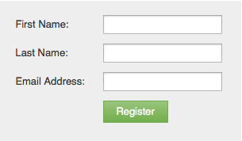

# Knoptekst voor verzenden van formulier wijzigen {#change-form-submit-button-text}

U kunt snel en gemakkelijk een formulierknop wijzigen van &quot;Verzenden&quot; in een ander woord. Zo gaat het.

1. Ga naar **[!UICONTROL Marketing Activities]** .

   

1. Selecteer het formulier en klik op **[!UICONTROL Edit Form]** .

   

1. Selecteer de knop en wijzig **[!UICONTROL Label]** .

   

   >[!TIP]
   >
   >U kunt ook het Wachten Label wijzigen. Dit wordt weergegeven nadat op de knop is geklikt en voordat de handeling voor het verzenden van het formulier is voltooid.

1. Klik op **[!UICONTROL Finish]**.

   

1. Klik op **[!UICONTROL Approve and Close]**.

   

   Bam!

   
