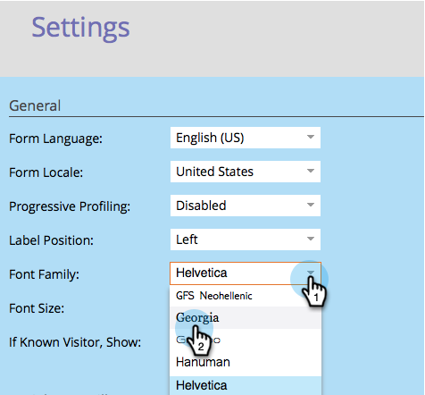

# De lettertypefamilie van het formulier wijzigen {#change-the-form-font-family}

Google Fonts zijn geweldig, en we hebben ze direct in de formuliereditor gebouwd. Kijk eens!

>[!NOTE]
>
>Deze instelling is van invloed op het formulierlabel, de invoertekst en alle RTF-gegevens.

1. Ga naar **Marketing** **Activiteiten**.

   

1. Selecteer het formulier en klik op **Formulier** bewerken ****.

   

1. Selecteer **Instellingen** onder **Formulierinstellingen******.

   

1. Selecteer de gewenste **lettertypefamilie** .

   >[!TIP]
   >
   >U kunt een aantal [Google-lettertypen](http://www.google.com/fonts) gebruiken.

   

1. Klik op **Voltooien**.

   

1. Klik op **Goedkeuren en Sluiten**.

   >[!NOTE]
   >
   >Het formulier moet zijn goedgekeurd voor gebruik op de aanlandingspagina&#39;s.

   

   >[!NOTE]
   >
   >**Herinnering**
   >
   >
   >Vergeet niet het concept van de bestemmingspagina goed te keuren dat door de formulierwijzigingen is gemaakt.

   

Zie hoe eenvoudig het was om de lettertypefamilie op een formulier te wijzigen? Koel, nu dat is gebeurd, leren we hoe we de tekengrootte van het formulier kunnen wijzigen.

>[!NOTE]
>
>**Verwante artikelen**
>
>* [De tekengrootte van het formulier wijzigen](change-the-form-font-size.md)

>

