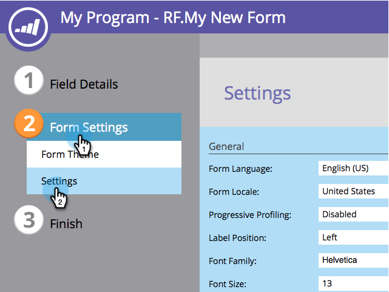

# De lettertypefamilie van het formulier wijzigen {#change-the-form-font-family}

Google Fonts zijn geweldig en we hebben ze direct in de formuliereditor ingebouwd. Kijk eens!

>[!NOTE]
>
>Deze instelling is van invloed op het formulierlabel, de invoertekst en alle RTF-gegevens.

1. Ga naar **[!UICONTROL Marketing Activities]** .

   

1. Selecteer het formulier en klik op **[!UICONTROL Edit Form]** .

   

1. Selecteer onder **[!UICONTROL Form Settings]** de optie **[!UICONTROL Settings]** .

   

1. Selecteer de **[!UICONTROL Font Family]** die u wilt.

   >[!TIP]
   >
   >Een groep [ de Doopvonten van Google ](https://fonts.google.com/){target="_blank"} zijn beschikbaar voor gebruik.

   

1. Klik op **[!UICONTROL Finish]**.

   

1. Klik op **[!UICONTROL Approve and Close]**.

   >[!NOTE]
   >
   >Het formulier moet zijn goedgekeurd voor gebruik op de aanvoerpagina&#39;s.

   

   >[!NOTE]
   >
   >Vergeet niet het concept van de bestemmingspagina goed te keuren dat door de formulierwijzigingen is gemaakt.

   

Zie hoe eenvoudig het was om de lettertypefamilie op een formulier te wijzigen? Koel, nu dat is gebeurd, leren we hoe we de tekengrootte van het formulier kunnen wijzigen.

>[!MORELIKETHIS]
>
>[ verander de Grootte van de Doopvont van de Vorm ](/help/marketo/product-docs/demand-generation/forms/form-design/change-the-form-font-size.md)
