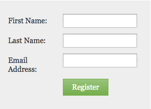

# De tekengrootte van het formulier wijzigen {#change-the-form-font-size}

Marketo maakt het voor u gemakkelijk om het uiterlijk van uw formulieren aan te passen. U kunt bijvoorbeeld de tekengrootte wijzigen. Zo gaat het.

>[!TIP]
>
>Deze instelling is van invloed op het formulierlabel, de invoertekst en de tekst van de verzendknop.

1. Ga naar **Marketingactiviteiten**.

   

1. Selecteer het formulier en klik op **Formulier bewerken**.

   

1. Onder **Formulierinstellingen**, selecteren **Instellingen**.

   

1. Selecteer **Tekengrootte** wilt u.

   

1. Klikken **Voltooien**.

   

1. Klikken **Goedkeuren en Sluiten**.

   >[!NOTE]
   >
   >Het formulier moet zijn goedgekeurd voor gebruik op de aanlandingspagina&#39;s.

   

   >[!NOTE]
   >
   >Vergeet niet het concept van de bestemmingspagina goed te keuren dat door de formulierwijzigingen is gemaakt.

   

Stukje cake! Je hebt dit.
